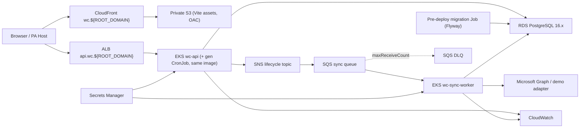
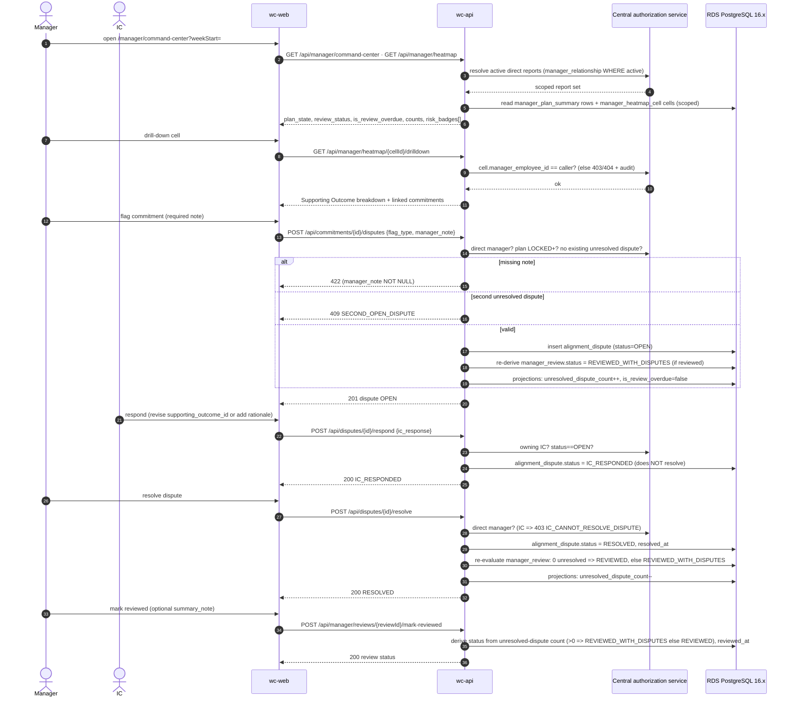
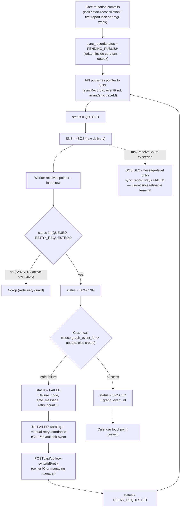

# ARCHITECTURE.md — ST6 Weekly Commit Module (WC)

> **Build contract.** This file is the binding design contract for WC. Downstream skills (`/tasks-gen` → `MVP_TASKS.md`, the `/tdd` engine, `/check-arch`, the area `CLAUDE.md` cross-doc-invariants table) treat it as the source of truth. Typed models that mirror a section are listed in **Appendix A**; a field change requires an edit to the matching `§` section **and** Appendix A in the same round of commits. Phases in `MVP_TASKS.md` cite their `§<N>` anchors as "spec anchors."
>
> Finalized by `/arch-finalize` (Brain 2, Opus 4.8) on 2026-06-02 from `ARCHITECTURE_DRAFT.md` + the `docs/planning/*` corpus, after a 16-dimension adversarial gap audit (`docs/gap-audits/001-arch-finalize-gap-audit.json`). The "Edits from the rough draft" log and four human-confirmed load-bearing decisions are recorded in §22.

## Executive summary

WC is a **strategy-enforced weekly alignment system** that replaces the weekly Check-in / Priorities / Objectives-linking slice of 15Five — not the full 15Five suite. Individual contributors (ICs) draft weekly commitments that **must each link to a Supporting Outcome** in the read-only RCDO hierarchy (Rally Cry → Defining Objective → Supporting Outcome) before the plan can lock; direct managers use an **Alignment Command Center** to see plan state, review accountability, RCDO coverage, alignment risk, and reconciliation risk across direct reports before the week drifts.

The system is a **production-shaped AWS micro-frontend**: a React 18 / Vite 5 Module Federation remote served from a private S3 bucket via CloudFront; a Spring Boot 3.3 (Java 21) REST API and a separate Outlook sync worker on EKS; an EKS CronJob that generates weekly plan shells; RDS PostgreSQL (major 16); and SNS → SQS → DLQ for **non-blocking** Outlook Graph calendar sync. It runs **standalone** for the assessment (seeded personas, demo Graph/Auth0 adapters) while preserving production-compatible Module Federation and Auth0 boundaries.

The correctness spine is server-side: **required Supporting-Outcome enforcement at lock**, **locked-baseline immutability**, **central service-layer authorization** (IC self-access + manager direct-report scoping, no IDOR), **synchronous manager read-model projections**, and **idempotent, non-blocking calendar sync** backed by a durable sync-record outbox. Manager review is **accountable but never blocking** — a missed review becomes a *derived* `OVERDUE` signal, not a workflow stop.

> **Architecture sentence:** *Every locked weekly commitment maps to exactly one Supporting Outcome; managers see alignment drift in a direct-report command center; calendar sync and manager review are visible but never block the IC weekly lifecycle.*

## Locked decisions (do not weaken without human sign-off)

Baseline is `docs/planning/DECISIONS.md`. Load-bearing choices carried into this contract:

- **Posture:** strategy-enforced weekly alignment slice, *not* a full 15Five clone (non-goals in §1).
- **Atomic unit:** Weekly Commitment (value); Weekly Plan (lifecycle container).
- **Plan lifecycle:** `DRAFT → LOCKED → RECONCILING → RECONCILED`; **no unlock/amend** in MVP.
- **Manager review source statuses:** `NOT_REVIEWED`, `REVIEWED_WITH_DISPUTES`, `REVIEWED`; **`OVERDUE` is derived at read time, never stored.** *(This deliberately supersedes the expanded PRD's literal `…→OVERDUE` state machine — see §3 and Appendix A.)*
- **Manager scope:** direct reports only; drafts viewable, but formal review/dispute begins only after lock. A manager's review/dispute **mutation** on a not-yet-locked direct-report plan (E16/E17) is rejected with `409 ILLEGAL_STATE_TRANSITION` — a **workflow-state error, NOT an audited authorization denial** (the manager *is* authorized as the active direct manager; the plan simply isn't locked). Audits are reserved for genuine denials (IDOR `404`, capability `403`), never routine state-precondition failures (REQ-F-009/010; proven 5.6, test-pinned via `verify(auditService, never())`).
- **Baseline immutability:** planned commitment baseline fields are frozen at lock (§3).
- **RCDO:** read-only seeded reference data; no admin UI; pass-up/escalation deferred.
- **AWS topology required:** EKS (API + worker + CronJob), RDS PostgreSQL 16.x, S3/CloudFront OAC, SNS/SQS/DLQ, Route 53/ACM, ECR, Secrets Manager, CloudWatch. Terraform + GitHub Actions.
- **Domains:** `wc.${ROOT_DOMAIN}` (frontend), `api.wc.${ROOT_DOMAIN}` (API).
- **Auth0** is the production auth boundary; demo persona mode is env-gated (`DEMO_AUTH_ENABLED`).
- **Outlook Graph failures never block** the core lifecycle; the sync record doubles as a durable outbox; queue messages are pointer payloads only.
- **Manager command center** uses synchronous read-model tables (`manager_plan_summary`, `manager_heatmap_cell`).
- **E2E:** Cypress + Cucumber/Gherkin is the primary acceptance suite; Playwright is optional/ad hoc.

**Four `/arch-finalize` decisions (confirmed 2026-06-02):** (1) DB targets **PostgreSQL major 16, latest available RDS 16.x minor** (16.4 is no longer creatable); (2) **keep Spring Boot 3.3**, documenting its 2025-06-30 OSS-EOL; (3) **keep the manager review-block Outlook event** with a corrected per-manager/week key; (4) **comments are flat (one-level) in MVP**, schema kept nestable.

---

## §1 — Goals & non-goals

**Goals**

1. Enforce strategic linkage: every **planned** commitment links to a Supporting Outcome before lock; locked plans are 100% linked.
2. Preserve a locked planned baseline so planned-vs-actual reconciliation is meaningful.
3. Give managers direct-report visibility into plan state, review accountability, RCDO coverage (heatmap), alignment disputes, and reconciliation/carry-forward risk.
4. Make manager review accountable (SLA + derived overdue) **without blocking** IC reconciliation.
5. Integrate Outlook Graph calendar touchpoints (IC planning, IC reconciliation, manager review-block) as **non-blocking, idempotent, recoverable** sync.
6. Run standalone for the assessment while preserving production-compatible Module Federation + Auth0 boundaries, deployed on the required AWS topology with custom domains.

**Non-goals (MVP)** — engagement surveys; pulse/sentiment; High Fives/recognition; full Best-Self/360 reviews; performance ratings/calibration; compensation/talent matrix; full 1-on-1 workspace; manager coaching (Kona-like); HR analytics; HRIS provisioning; RCDO admin UI; multi-level pass-up/escalation & leadership rollups; true live updates (WebSocket/SSE/push); unlock/amend after lock; holiday-aware SLA; user-local week timezones; per-report manager calendar events; SQS DLQ admin redrive UI; full PA LogRocket/Loki/Nx replication.

## §2 — System overview

**Runtime components**

- **`wc-web`** — React 18, Vite 5, TypeScript strict, RTK Query, Flowbite React, Tailwind. A Module Federation **remote** exposing one mountable module; also runs standalone.
- **`wc-api`** — Spring Boot 3.3 REST API: domain services, central authorization, synchronous projections, SNS publisher. The **same image** also runs the weekly-shell **generation** batch entrypoint (CronJob) under a generation profile (no third image).
- **`wc-sync-worker`** — separate Spring Boot deployable consuming SQS Outlook sync jobs; calls the Graph/demo adapter; updates sync records.
- **`migration job`** — a one-shot pre-deploy Job (the `wc-api` image in a `flyway-migrate` profile) that is the **sole** owner of schema migration + seed (see §12).
- **PostgreSQL (RDS, major 16)** — domain state, projections, sync records (outbox), audit events.
- **AWS** — EKS, RDS, ECR, SNS, SQS + DLQ, S3, CloudFront (OAC), Route 53, ACM, Secrets Manager, CloudWatch.



**End-to-end flow:** (1) migration Job runs Flyway + seed; (2) CronJob generates idempotent weekly DRAFT shells; (3) IC edits commitments + links Supporting Outcomes, then locks; (4) API validates links, freezes baseline, creates the manager review record + `reviewDueAt`, projections, audit event, and an `IC_PLANNING` sync record, then publishes a pointer to SNS; (5) SQS delivers to the worker, which calls Graph/demo and records `graphEventId` or a safe failure; (6) manager reviews direct reports, opens/resolves disputes (review-block event upserted per manager/week); (7) IC reconciles outcomes, adds explicit unplanned work, carries unfinished work forward into next week.

## §3 — Domain model & state machines

Source entities: Employee, Manager Relationship, Weekly Plan, Weekly Commitment, Rally Cry, Defining Objective, Supporting Outcome, Manager Review, Alignment Dispute, Comment, Outlook Calendar Sync Record, Audit Event. Projection entities: Manager Plan Summary, Manager Heatmap Cell. (Physical schema: §4; full inventory: Appendix A.)

**Chess layer** (commitment metadata): `priority` P0/P1/P2 · `workType` Strategic/Maintenance/Blocker/Unplanned · `confidence` High/Medium/Low · `alignmentStatus` Aligned/Needs-Review/Misaligned · `managerAlignmentNote` (manager-owned, optional). **`alignmentStatus` ownership rule:** the IC sets it as a *self-assessment* during DRAFT; after LOCK it is **read-only on the commitment** and manager concerns flow exclusively through Alignment Disputes. `managerAlignmentNote` is the one manager-owned, post-lock-mutable, audit-logged commitment field (satisfies REQ-F-006; resolves the draft's "managerNote with no column").

**Plan lifecycle** — `DRAFT → LOCKED → RECONCILING → RECONCILED`. Forward-only; all other/backward/self transitions are rejected with a `409` named-constraint error (§5). No unlock/amend.

```mermaid
stateDiagram-v2
  [*] --> DRAFT: CronJob creates shell
  DRAFT --> LOCKED: lock (≥1 planned commitment; all planned linked)
  LOCKED --> RECONCILING: start-reconciliation
  RECONCILING --> RECONCILED: close-reconciliation (all outcomes + unplanned links present)
  RECONCILED --> [*]
  note right of LOCKED: Manager review + disputes act here (parallel, non-blocking)
  note right of RECONCILING: Unplanned work added; carry-forward seeds next week's DRAFT
```

**Manager review** (parallel, non-blocking) — source statuses `NOT_REVIEWED → REVIEWED_WITH_DISPUTES`, `NOT_REVIEWED → REVIEWED`, `REVIEWED_WITH_DISPUTES → REVIEWED`. **`OVERDUE` is derived**, never stored: `isOverdue = (now > reviewDueAt) AND status = NOT_REVIEWED`. `REVIEWED_WITH_DISPUTES` **satisfies the SLA** (`isOverdue=false`) while unresolved disputes still surface as alignment risk (REQ-F-013). Status is derived server-side at `mark-reviewed` from the plan's unresolved-dispute count (>0 ⇒ `REVIEWED_WITH_DISPUTES`); resolving the last dispute re-evaluates `REVIEWED_WITH_DISPUTES → REVIEWED`; opening a dispute on a `REVIEWED` plan moves it back to `REVIEWED_WITH_DISPUTES`. An overdue/derived-state computation uses an injectable `Clock` (§17). *This model intentionally supersedes the expanded PRD's stored-`OVERDUE` state machine.*

**Alignment dispute** — `OPEN → IC_RESPONDED → RESOLVED`. Manager opens with required note (`NEEDS_REVISION` | `MISALIGNED`); IC responds (revise Supporting Outcome or add rationale) — response does **not** resolve; only the direct manager resolves. The IC's response (E18) may revise the disputed commitment's `supporting_outcome_id` — a **deliberate, tightly-gated exception to locked-baseline immutability** (rule #2): the only post-lock path (besides the `RECONCILING`+unplanned cell) that mutates a locked commitment's SO, reachable only via respond-on-an-`OPEN`-dispute by the owning IC, loaded by the dispute's `commitment_id` (no cross-commitment vector), touching only `supporting_outcome_id`, audited (`DISPUTE_RESPONDED`; realized 5.4). **At most one unresolved dispute per commitment** (partial unique index over `OPEN`,`IC_RESPONDED`).

**Commitment outcome** (reconciliation) — `Completed | Partially-completed | Blocked | Canceled | Carried-forward`. **Single-outcome rule (locked MVP simplification):** `CARRIED_FORWARD` is mutually exclusive with completion outcomes; "partially complete *and* carry the remainder" is not representable in one record — partial work is `PARTIALLY_COMPLETED`, and any continuing work is a fresh next-week commitment via carry-forward. Tested in §17. Carry-forward is an outcome on the source commitment that creates a linked DRAFT commitment in the next Monday–Sunday plan (creating that shell if absent).

**Invariants** — one Weekly Plan per (employee, week); a plan cannot lock with zero planned commitments or any unlinked planned commitment; locked planned baseline is immutable; unplanned commitments are labeled and must link a Supporting Outcome before reconciliation close; carry-forward links back to its source; one unresolved dispute per commitment; **single active manager per direct report** (§6); Outlook failure never rolls back core mutations; system-initiated mutations (generation, worker) are audit-logged under a SYSTEM actor.

## §4 — Physical data model

Conventions: RDS PostgreSQL **major 16 (latest available 16.x minor at provision time; ≥16.13)**, minor as a Terraform variable with `auto_minor_version_upgrade=true`. UUID PKs; `VARCHAR` status columns with `CHECK` constraints (not native enums); entities extend `AbstractAuditingEntity`; **optimistic locking via JPA `@Version`** on mutable lifecycle entities (`weekly_plan`, `weekly_commitment`, `manager_review`, `alignment_dispute`, sync records) to guard double-lock and projection-update races. Full per-table DDL lives in `docs/planning/DATA_MODEL.md`; Appendix A is the binding contract index. Key tables and the deltas this contract pins:

- **`employee`** — `role ∈ {IC, MANAGER}` (single-valued; a manager who also owns a plan acts as IC for their own plan — authorization is **relationship-driven**, not role-driven, except heatmap/team reads which require a manager relationship).
- **`manager_relationship`** — `(manager_employee_id, direct_report_employee_id)` unique; **+ partial unique index on `direct_report_employee_id WHERE active = true`** (enforces single active manager per report, making the single-row review/dispute model provably consistent).
- **`rally_cry` / `defining_objective` / `supporting_outcome`** — read-only seeded RCDO (1 / 3 / 3-per-DO shape, §13).
- **`weekly_plan`** — `state ∈ {DRAFT,LOCKED,RECONCILING,RECONCILED}`; unique `(employee_id, week_start_date)`; lifecycle timestamps; `@Version`.
- **`weekly_commitment`** — one table for PLANNED + UNPLANNED (`commitment_kind`); chess fields (`priority`, `work_type`, `confidence`, `alignment_status`); **`manager_alignment_note text null`** (NEW — manager-owned, post-lock-mutable, audit-logged); `supporting_outcome_id` (nullable until lock for planned; required before reconciliation close for unplanned); `reconciliation_outcome ∈ {COMPLETED,PARTIALLY_COMPLETED,BLOCKED,CANCELED,CARRIED_FORWARD}`; `outcome_note`; `carry_forward_source_commitment_id`. **`progress_status` is dropped** (redundant with `reconciliation_outcome` + `outcome_note`). Indexes incl. `(weekly_plan_id, commitment_kind)`, `(supporting_outcome_id)`, `(alignment_status)`, **+ `(priority)`, `(work_type)`** to back command-center filters (§5/§9).
- **`manager_review`** — `status ∈ {NOT_REVIEWED,REVIEWED_WITH_DISPUTES,REVIEWED}` (no stored OVERDUE); `review_due_at` persisted at lock; `reviewed_at`, `summary_note`; one per plan.
- **`alignment_dispute`** — `status ∈ {OPEN,IC_RESPONDED,RESOLVED}`, `flag_type ∈ {NEEDS_REVISION,MISALIGNED}`, `manager_note NOT NULL`, `ic_response`; **partial unique index `(commitment_id) WHERE status IN ('OPEN','IC_RESPONDED')`** (carried verbatim into Flyway).
- **`comment`** — `target_type ∈ {PLAN, COMMITMENT}` only (MVP narrowed from the draft's 4 targets — review/dispute targets deferred). Columns `parent_comment_id`, `path`, `depth` retained but **flat in MVP** (`parent_comment_id` always NULL, `depth=0`, no path maintenance) per the §22 decision; schema stays nestable.
- **`outlook_calendar_sync_record`** (durable outbox) — `related_type ∈ {WEEKLY_PLAN, MANAGER_REVIEW_WEEK}`; `event_kind ∈ {IC_PLANNING, IC_RECONCILIATION, MANAGER_REVIEW_BLOCK}`; `status` (§10); `graph_event_id`, `failure_code`, `safe_message`, `retry_count`, `trace_id`; **+ `week_start_date date null`**. Uniqueness: keep `(owner_employee_id, related_type, related_id, event_kind)` for plan-related kinds; **add partial unique `(owner_employee_id, week_start_date) WHERE event_kind='MANAGER_REVIEW_BLOCK'`** — for review-block, `owner_employee_id` = the manager, `related_type='MANAGER_REVIEW_WEEK'`, `related_id` = manager id, giving the locked "one event per manager/week" grain DB-level idempotency.
- **`manager_plan_summary`**, **`manager_heatmap_cell`** — synchronous projections (§9). `manager_heatmap_cell.risk_badges text[]` drawn from the **enumerated badge vocabulary**: `MISALIGNED, NEEDS_REVIEW, BLOCKED, CARRY_FORWARD, UNREVIEWED, OVERDUE_REVIEW`.
- **`audit_event`** — `actor_employee_id` nullable (SYSTEM actions); `action`, `entity_type`, `entity_id`, `summary`, `metadata_json` (safe metadata only — no secrets/PII bodies).

## §5 — REST API contracts

Spring MVC REST/JSON; **DTOs (never entities) cross the boundary**; Spring Data `Pageable` for manager list views; resource endpoints + **explicit lifecycle command endpoints** so transitions are auditable. DTOs carry IDs, display labels, state, timestamps, RCDO breadcrumbs, risk badges, and an **`allowedActions[]`** array for the current actor (UI affordance only — never the authorization source).

**Problem-details error model (RFC-7807).** Every error returns `{type, title, status, detail/safeMessage, code, constraint?, fieldErrors?[], traceId}`. Status mapping: `400/422` validation; `403` authorization denial; **`404` not-found-or-not-authorized** (IDOR-safe — never reveal existence); `409` state-precondition/conflict (incl. optimistic-lock). Named `code`s for assertion by frontend + BDD: `EMPTY_PLAN_LOCK`, `UNLINKED_PLANNED_COMMITMENT`, `LOCKED_BASELINE_EDIT`, `SECOND_OPEN_DISPUTE`, `IC_CANNOT_OPEN_DISPUTE`, `IC_CANNOT_RESOLVE_DISPUTE`, `MANAGER_ROLE_REQUIRED`, `UNPLANNED_MISSING_LINK_AT_CLOSE`, `ILLEGAL_STATE_TRANSITION`.

**Representative endpoints** — `GET /api/me` · `GET /api/rcdo` (full hierarchy for browse/search) · `GET /api/plans/current` · `GET /api/plans/{id}` · `POST /api/plans/{id}/commitments` · `PATCH /api/commitments/{id}` · `DELETE /api/commitments/{id}` · `POST /api/plans/{id}/lock` · `POST /api/plans/{id}/start-reconciliation` · `POST /api/plans/{id}/close-reconciliation` · `POST /api/plans/{id}/unplanned-commitments` · `POST /api/commitments/{id}/carry-forward` · `GET /api/manager/command-center?weekStart=&page=&size=&{filters}` · `GET /api/manager/heatmap?weekStart=&definingObjectiveId=&supportingOutcomeId=` · `GET /api/manager/heatmap/{cellId}/drilldown` · `POST /api/manager/reviews/{reviewId}/mark-reviewed` · `POST /api/commitments/{id}/disputes` · `POST /api/disputes/{id}/respond` · `POST /api/disputes/{id}/resolve` · `GET /api/comments?targetType=&targetId=` · `POST /api/comments` · `GET /api/outlook-sync?planId=` (IC reads own sync status) · `POST /api/outlook-sync/{syncRecordId}/retry` · `GET /actuator/health/{liveness,readiness}`.

**Command preconditions & semantics (state constraints):**

- `lock`: requires `DRAFT` + ≥1 planned commitment + every planned commitment linked → freezes baseline, creates `manager_review` (`NOT_REVIEWED`, `reviewDueAt` = end of next business day, org tz, weekdays-only), projections, audit, `IC_PLANNING` sync record + the manager's per-week `MANAGER_REVIEW_BLOCK` record (idempotent upsert).
- `PATCH /commitments/{id}`: **rejects any immutable planned-baseline field** (title, description, supporting_outcome, priority, work_type, confidence, commitment_kind, plan/week ownership) after lock. During `RECONCILING` it is the contract for **recording outcomes** — accepts `{reconciliation_outcome, outcome_note}` and, for unplanned commitments, `supporting_outcome_id`. Manager-owned `manager_alignment_note` is mutable post-lock by the direct manager only.
- `start-reconciliation`: requires `LOCKED`. `close-reconciliation`: requires `RECONCILING` **AND every planned commitment has a non-null `reconciliation_outcome` AND every unplanned commitment has both an outcome and a `supporting_outcome_id`**.
- `carry-forward`: requires `RECONCILING`; **idempotent per source commitment** (re-invoke returns the existing linked next-week commitment keyed on `carry_forward_source_commitment_id`); creates the next-week DRAFT shell only if absent (reusing on unique-constraint conflict). Returned commitment starts unlinked-DRAFT (no lock immutability).
- `mark-reviewed`: requires `LOCKED`+, direct manager; accepts optional `summary_note`; **derives** `REVIEWED` vs `REVIEWED_WITH_DISPUTES` server-side from unresolved-dispute count.
- `disputes` create: plan `LOCKED`+, direct manager, required `manager_note`, no existing unresolved dispute. `respond`: status `OPEN`, owning IC. `resolve`: status `OPEN|IC_RESPONDED`, direct manager — re-evaluates parent review status.
- `comments` create: see §11 (authorizer resolves target → owning plan; manager targets require `LOCKED`+).
- `outlook-sync/{id}/retry`: status `FAILED`, actor owns (IC) or manages (manager) the record's `owner_employee_id`.

All command endpoints are guarded by optimistic concurrency; conflicting concurrent transitions return `409`.

## §6 — Authorization & identity

**Authentication.** Real mode: Spring Security OAuth2 Resource Server validates Auth0 JWTs. Pin the mechanism: `JwtDecoder = JwtValidators.createDefaultWithIssuer(issuer)` **plus a custom `AudienceValidator`** (Auth0 **does not** validate audience by default) combined via `DelegatingOAuth2TokenValidator`; require `RS256`, reject `alg=none`/symmetric, enforce `exp`/`nbf` with bounded clock skew; **issuer AND audience are mandatory**. Demo mode: backend accepts an `X-Demo-Employee-Id` identity header **only when `DEMO_AUTH_ENABLED=true`** (rejected otherwise). Auth0 claim names are configurable; required identity fields (employee id, role, manager-relationship lookup) are stable.

**Authorization — three principals.** (1) **IC** — self-access to own plans/commitments/disputes/comments. (2) **Manager** — direct-report-scoped reads/mutations. (3) **SYSTEM** — the generation CronJob and sync worker carry no user request: they enter via dedicated system-context entrypoints, are **exempt** from self/direct-report checks, are limited to their own write surface (generation → plan shells; worker → sync-record state + `graph_event_id`, never commitment/review/dispute content), and **still write `audit_event` under a SYSTEM actor**.

A **central domain authorization service** owns every resource check before repository read/mutation; controller annotations are coarse authn/role gates only. Projection endpoints scope by the authenticated manager's active direct reports **and** single-resource reads authorize on the row's own `manager_employee_id` (not just list filtering). **Required denial cases** (each `403`/`404` + an authorization-denial `audit_event`): IC reads/mutates another IC's plan; manager touches a non-direct-report plan/review/dispute/comment; manager opens a heatmap **drill-down cell** not their own; IC resolves a dispute; IC accesses the team heatmap; comment on an unauthorized `target_id`; sync-retry on an unowned record; demo header when demo mode disabled. **CORS** (the cross-origin control between `wc.` and `api.wc.`) is defined in §12 and is also a security boundary (§16).

**Realized (Phase 2, 2.4–2.7).** `PrincipalResolver` maps a validated-JWT `Auth0Identity` OR a demo `employeeId` → a `UserPrincipal` (authoritative `Employee.role`; relationship-driven `isManager`; an **inactive** employee → `Optional.empty()` → 401 IDOR-safe); a `sealed DomainPrincipal permits UserPrincipal, SystemPrincipal`. The central `DomainAuthorizationService` enforces the required-denial set with a pinned **403/404 mapping** — cross-owner/cross-team/missing → **404** (existence-hiding); capability/role → **403** + a named code (`IC_CANNOT_RESOLVE_DISPUTE`, `MANAGER_ROLE_REQUIRED`); each **genuine** denial writes one safe-metadata `audit_event` (action `AUTHORIZATION_DENIED`) in `Propagation.REQUIRES_NEW` (survives a rolled-back mutation); a genuinely-**missing** resource → 404 with **no** audit (anti-spam). `SecurityConfig` wires **one `@ConditionalOnProperty(demo-auth.enabled)` `SecurityFilterChain` per mode** (real = OAuth2 JWT + `DemoAuthFilter`-as-rejector; demo = `DemoAuthFilter`-as-authenticator), resolves every identity to a `UserPrincipal` in both, renders RFC-7807 at three points (entry-point 401 / access-denied 403 / `@RestControllerAdvice` 404/403/500), and **fails fast at startup on a non-boolean gate** — making 2.1–2.5 request-reachable. `GET /api/me` (`MeDto` B.3; `persona=email`; authenticated-only) + an exact-origin `CorsConfigurationSource` (no wildcard, `allowCredentials=false`, **mode-independent** so demo can't widen — §12/§16) **close Phase 2**: the full authn→authz→DTO request path is live. **Guard:** the team-heatmap + every manager *resource* surface must route through `DomainAuthorizationService` (for the coded+audited `MANAGER_ROLE_REQUIRED` denial), NOT a coarse `@PreAuthorize` (which yields a generic 403 with no code/audit).

## §7 — Frontend architecture & micro-frontend boundary

`apps/wc-web` — React 18, Vite 5, TS strict, Flowbite React + Tailwind utilities, **RTK Query for all API calls** (no Saga/Thunk, no CSS Modules/styled-components, no SSR). Module Federation remote exposing **one** module; shared singletons: React, React DOM, Redux Toolkit, React-Redux.

**Styling source of truth (binding).** The frontend's visual design is the **Cadence design system** at `docs/design/cadence-design-system/` (Linear-dark; six-tone semantic taxonomy; tokens in `colors_and_type.css`). **Dark is the default; a persisted light-mode toggle flips a `[data-theme]` attribute** (standalone-only toggle, tree-shaken from the remote). Cadence is applied **Tailwind/Flowbite-native** (tokens → `tailwind.config` theme + a Flowbite-React custom theme; no bespoke component CSS — one token-var stylesheet is the only exception). It **overrides `docs/design/UI_UX_SPEC.md §4.1`'s light foundation palette + `blue-600` brand** (→ dark surfaces + indigo `#5E6AD2`, interactive-only; Info-status-blue split to its own hue) while preserving the six-tone semantic taxonomy and **every enum→tone mapping 1:1** — a **render-only** override, no enum/Appendix-A contract change (`RiskBadge`/`AlignmentStatus`/`ReviewStatus` vocabularies untouched). Frontend styling plan: `docs/planning/frontend-styling-proposal.md`; tracker: **Phase ST**.

**Decomposition (standalone vs remote).** The exposed remote module is a single mountable component — `expose: { './WeeklyCommitApp': './src/remote/WeeklyCommitApp.tsx' }` — rendering the WC route subtree via a router context it **consumes** (does not create). A separate `src/standalone/main.tsx` owns `BrowserRouter`, the Redux store provider, the identity provider, and the persona-switcher chrome, and mounts the exposed module. Routes (lazy-loaded via `React.lazy` + dynamic `import()` for sub-second initial render, REQ-NF-005): `/` (persona-aware default) · `/weekly-commit` (IC current plan) · `/weekly-commit/history/:planId` · `/manager/command-center` · `/manager/heatmap`. **Realized (9.4):** `routes/AppRoutes.tsx` registers the five routes under one `Suspense`(`LoadingState`) with a local `RouteErrorBoundary` rendering the shared `ErrorState` (generic, **leak-free** message — never the chunk path/error detail, safety rule #7) on a failed lazy import; manager routes are **not registered** when an `isManager` seam is false (an IC has no `/manager` entry point, REQ-UX-005) with a catch-all `*` → `<Navigate to="/">`; `WeeklyCommitApp` renders `<AppRoutes/>` and still creates no `BrowserRouter`. The persona-aware `/` redirect + the real `MeDto.isManager`-backed gating land in 9.5 (9.4 uses an interim `App` landing + a default-false role seam).

**Host integration contract (resolves the §-critical remote-auth gap).** In **remote** mode the PA host passes an auth accessor — `getAccessToken(): Promise<string>` — into the mounted module (prop or host-populated shared singleton); RTK Query `prepareHeaders` calls it to set `Authorization: Bearer <jwt>`. In **standalone** mode the same accessor is satisfied by the demo/Auth0 identity provider. Auth mode is one source of truth — `VITE_AUTH_MODE = demo | auth0` (default `demo` standalone; `auth0` hosted): the `demo` branch attaches `X-Demo-Employee-Id: <persona>`, the `auth0` branch attaches the bearer token; **the two are never combined**, and the demo branch + **persona switcher live exclusively in `src/standalone/` and are tree-shaken/compiled out of the exposed remote build** (mirrors the backend `DEMO_AUTH_ENABLED` gate). API base URL is `VITE_API_BASE_URL` (local Compose for dev; `https://api.wc.${ROOT_DOMAIN}` deployed; host-overridable in remote mode). This is an explicit extension of ADR-004; exact PM parity stays open (§22, OQ-004). **Realized (9.1/9.3):** the auth accessor is a thin injectable seam (`getAccessToken` / a demo-id provider injected by the host or the standalone `DemoIdentityProvider`); `resolveApiBaseUrl` **fails fast on a production build when `VITE_API_BASE_URL` is unset** (no silent relative-`/` fallback in prod; dev/test fall back to `/`). The **single-React-instance guarantee is a host+remote shared-scope agreement (a host-integration contract), not** assumed from `@originjs/vite-plugin-federation` v1.4.1 — whose `singleton` flag is unimplemented (sharing only dedups version-matched chunks); the remote's seam-readiness / fallback contract is pinned in the **9.13 host-integration contract** (OQ-004).

**RTK Query.** Slices/tags: current user, RCDO, plans, commitments, manager summary, heatmap, disputes, comments, sync records. Mutations invalidate affected plan/manager-summary/heatmap/sync tags. **View states are a contract:** every data view renders explicit loading / empty / error / success / partial states; **no optimistic updates** (mutations refetch/invalidate); the API `safeMessage` renders as Cypress-assertable error text, including the **Outlook FAILED warning + manual-retry** affordance. **Realized (9.5–9.7):** the injected `tagTypes` (`app/tags.ts`) are the **9 lowercase** tags `me, rcdo, plans, commitments, review, disputes, manager, comments, sync` — the manager command-center **and** heatmap projections co-change (§9), so they share the single `manager` tag (**no separate `heatmap` tag**); `review` is the distinct mark-reviewed tag. Read-only domains (`rcdo`, `me`) are tagged-once-**never-invalidated** (REQ-D-003). Plans use **per-id** tags (`{type:'plans', id}` + a `'CURRENT'` sentinel; shared `planTags(planId)` in `app/tags.ts`); mutations (commitment CRUD + the lifecycle `lockPlan` E8, on `plansApi`) invalidate on **success only** (`error ? [] : tags`) → refetch-into-new-state, never an optimistic flip. The eager route-gating `getMe` query means the **remote hard-requires a host-provided Redux `<Provider>`** (+ the host `getAccessToken`) — the §22/OQ-004 host-integration contract must specify host-provides-store-and-accessor-**before-mount** (pinned at 9.13). `fetchBaseQuery` sets an `isJsonContentType` matching `application/problem+json` (RFC-7807) so error bodies parse. §3 read-only-post-lock fields (e.g. `alignmentStatus` when `state!=='DRAFT'`) render as static text, not disabled inputs. **Control gating is server-authoritative** — the UI never re-derives eligibility/authz/lifecycle-legality client-side; it gates only on the server's `allowedActions[]` (a `can()` helper) or server state, and surfaces the server's `409`/`safeMessage`/`fieldErrors[]` verbatim.

## §8 — Backend service architecture

`apps/wc-api` modules: identity/auth adapter, domain authorization service, weekly-plan service, commitment service, RCDO read service, manager-review service, dispute service, comment service, projection service, outlook-sync-record service (+ manager resolution for review-block), SNS publisher, audit service. Lifecycle transitions, state/authorization/immutable-field validation, **and synchronous projection updates** happen inside service-method transactions (never controller patches). Java build: Gradle multi-module (`shared`, `api`, `worker`).

**Weekly-shell generation:** the `wc-api` image launched in a one-shot generation profile (`--app.job=generate-plan-shells`), invoked by the EKS CronJob under the SYSTEM principal. Resolves the target Monday–Sunday week in org tz, creates a DRAFT shell per active employee, **idempotent** via the `(employee_id, week_start_date)` unique constraint; creates **no** Outlook sync records (REQ-I-002).

## §9 — Manager projections (read models)

Two synchronous projections (ADR-006): `manager_plan_summary` (one row per manager/report/week — plan_state, review_status, `is_review_overdue`, planned/unplanned/misaligned/needs-review/blocked/carry-forward/unresolved-dispute counts) and `manager_heatmap_cell` (manager × report × week × Defining Objective — counts + enumerated `risk_badges`). Rows update **synchronously in the same transaction** as commitment create/update/delete, plan lock, reconciliation start/close, dispute open/respond/resolve, mark-reviewed, and carry-forward. **Count derivation pinned:** `misaligned_count` = commitments with `alignment_status=MISALIGNED` **OR** an open dispute with `flag_type=MISALIGNED`; `REVIEWED_WITH_DISPUTES` keeps `is_review_overdue=false` while `unresolved_dispute_count` keeps surfacing risk (REQ-F-013). An internal rebuild **job/CLI** recomputes both tables from source (no admin UI). **Command-center filters (REQ-F-023)** — person, plan-state, review-state served from summary columns; Defining Objective from the heatmap grain; priority/work-type/alignment-status via the indexed commitment-level columns added in §4.

## §10 — Outlook calendar sync

**Triggers:** IC lock → `IC_PLANNING`; IC start-reconciliation → `IC_RECONCILIATION`; first direct-report lock of a manager/week → upsert the manager's `MANAGER_REVIEW_BLOCK` (idempotent on the per-manager/week key, §4). Generated shells create **no** events.

**Sync-record state machine** (states `PENDING_PUBLISH, QUEUED, SYNCING, SYNCED, FAILED, RETRY_REQUESTED`) — transition owners: API writes `PENDING_PUBLISH` in the core txn → after SNS publish sets `QUEUED`; worker on receive sets `SYNCING`; Graph success → `SYNCED` (+`graph_event_id`); failure → `FAILED` (+`failure_code`, `safe_message`, `retry_count++`). **Manual retry**: `FAILED → RETRY_REQUESTED`, the **API re-publishes the same pointer to the SNS topic** (single publish path) → `QUEUED`. **Worker redelivery guard:** on a `syncRecordId` the worker loads the row and treats `SYNCED`/active-`SYNCING` as a no-op; it only (re)attempts Graph when status ∈ `{QUEUED, RETRY_REQUESTED}`, reusing `graph_event_id` to **update** rather than create. DLQ landing is message-level only (SQS `maxReceiveCount`); the sync row stays `FAILED` (the user-visible retryable terminal); `retry_count` is informational.

**Topology:** one SNS lifecycle topic → one SQS sync queue (standard) with raw message delivery + redrive to one DLQ; pointer payload only (`syncRecordId`, `eventKind`, tenant/env, `traceId`) — no calendar bodies/secrets. **Graph adapter modes:** real (app-only tenant/admin consent, `Calendars.ReadWrite` application permission for user-calendar writes — see §22 mailbox-scoping note), demo-success, demo-failure. **Review-block target:** `owner_employee_id` = the locking IC's direct manager (resolved via `manager_relationship`), written to that manager's calendar. **Deep links:** the worker gets `WC_FRONTEND_BASE_URL` (= `https://wc.${ROOT_DOMAIN}`) via config; IC events → `{base}/weekly-commit[/history/{planId}]`, review-block → `{base}/manager/command-center`. Failures are non-blocking, logged with safe messages, and surfaced to the owning user via `GET /api/outlook-sync` + retry.

## §11 — Comments & collaboration

Flat (one-level) comments in MVP on `target_type ∈ {PLAN, COMMITMENT}` (§4/§22). The comment authorizer resolves `target_type`+`target_id` to the owning plan (commitment→plan), **rejects unseeable/nonexistent targets with `404`** (closes target-id IDOR), and applies the same self/direct-report rule as the target: ICs may comment on their own plan/commitment; managers only on direct-report targets when the plan is `LOCKED`-or-later (REQ-F-014). The dispute IC-response uses the dedicated `alignment_dispute.ic_response` field, not comments. Nested threading (path/depth maintenance, review/dispute targets) is deferred — schema columns are retained so it can be enabled later.

## §12 — AWS deployment architecture

Terraform (default region `us-east-1`, overridable) provisions: EKS managed node group; RDS PostgreSQL 16.x; ECR; SNS topic; SQS queue + DLQ; private S3 + CloudFront (OAC, SPA fallback to `index.html`); Route 53 alias records; ACM certs (**CloudFront cert in `us-east-1`**; ALB cert regional); Secrets Manager; IAM/IRSA. `wc-api` behind ALB at `api.wc.${ROOT_DOMAIN}` via AWS Load Balancer Controller; frontend at `wc.${ROOT_DOMAIN}`. `ROOT_DOMAIN` is a required deploy variable.

**Flyway migration ownership (resolves the §-critical race).** A **dedicated pre-deploy Kubernetes Job** (the `wc-api` image in a `flyway-migrate` profile) is the **sole** schema owner and runs **before** API/worker Deployments and the CronJob roll. `spring.flyway.enabled=false` on the worker and CronJob. The RCDO + human-readable demo seed run as **Flyway migrations** (deterministic, idempotent); the 2,000-record synthetic perf seed (REQ-D-008) is a **separate opt-in** Job, never part of normal deploy.

**CronJob = `wc-api` image** in generation mode (no third ECR image); reads the DB secret only. **Secrets injection:** Secrets Store CSI Driver + ASCP; Spring reads via mounted file (`spring.config.import=optional:file:/mnt/secrets/...`) — REQ-S-004's "environment variables" is intent, a file mount satisfies it. **Per-workload IRSA least privilege:** api SA → `sns:Publish` + `secretsmanager:GetSecretValue` (db/auth0/graph); worker SA → `sqs:{ReceiveMessage,DeleteMessage,GetQueueAttributes}` on queue+DLQ + `GetSecretValue` (graph only); CronJob SA → `GetSecretValue` (db only); migration Job SA → `GetSecretValue` (db only). **CORS** (Spring-owned; ALB/CloudFront pass through): allow origin exactly `https://wc.${ROOT_DOMAIN}` (+ `http://localhost:<vite-port>` dev), methods `GET/POST/PATCH/DELETE/OPTIONS`, headers `Authorization, Content-Type, X-Demo-Employee-Id`, `allowCredentials=false` (bearer transport), preflight `OPTIONS` bypasses JWT; demo mode must **not** relax CORS.

## §13 — CI/CD & local dev runtime

**GitHub Actions** (auth to AWS via **OIDC federation** — `aws-actions/configure-aws-credentials` assuming one least-privilege CI deploy role; **no long-lived keys**, per REQ-S-010/RISK-016): lint/format (ESLint 9, Prettier 3.3, Spotless) → unit tests + coverage (Vitest; JaCoCo ≥80% **per Gradle module** across api/worker/shared) → SpotBugs → **local Cypress/Cucumber E2E** against Compose services → build+push api & worker images to ECR → `terraform plan/apply` → `aws eks update-kubeconfig` → **run the migration Job (and wait for completion)** → deploy/roll EKS workloads → sync Vite assets to S3 + CloudFront invalidation → **deployed smoke suite** against custom domains. **Order note (Decision 1):** `terraform apply` runs BEFORE the migration Job — apply provisions the cluster + RDS + the cluster add-ons (§17) the Job runs on; the migration Job then completes (gated) before any Deployment/CronJob roll (§12). Terraform remote state (S3 backend + DynamoDB lock); CI role mapped via an EKS access entry.

**Local/CI runtime.** Docker Compose for PostgreSQL + full stack. **Async transport** is profile-switched: the `local/demo` profile, after the API commits the sync-record outbox, invokes the worker consume logic in-process (the durable outbox + pointer payload make this faithful) so worker + Outlook E2E run locally and in CI without live SNS/SQS; deployed AWS uses real SNS/SQS. Backend integration tests use **Testcontainers PostgreSQL** (no H2). Docker-in-CI is required for Testcontainers; ECR image tags = commit SHA.

## §14 — Performance

Read models back the manager surfaces (no live aggregation, no N+1, no client-side full loads). Targets: **p95 server-side latency < 200ms** for `GET /plans/current` and `GET /api/manager/command-center` — measured warm-JVM, single-client, against the 2,000-record synthetic seed via a Micrometer/Actuator timer or a JUnit+Testcontainers timing harness, with numbers recorded in the test-results artifact (turns REQ-T-012 into a defined pass/fail). Manager list views paginate (`Pageable`); **heatmap drill-down and comment lists are bounded/paginated** (no unbounded trees). Indexes per §4 back every filter path.

## §15 — Observability & audit

Spring Actuator `health/liveness` + `health/readiness` (used by k8s probes) on api + worker; CloudWatch logs/metrics for api, worker, CronJob, migration Job. No LogRocket/Loki replication (PA-owned). **Emitted signals** (structured, IDs + state only): plan locked; review due/overdue (overdue emitted at read time, §3)/reviewed; reconciliation started/closed; commitment carried-forward; dispute opened/responded/resolved; Outlook sync success/failure; **authorization denial**. **`audit_event`** durably records those sensitive actions (incl. demo-header-rejection and authorization denials) under actor (or SYSTEM). **Log hygiene:** CloudWatch logs and `audit_event.metadata_json` must **never** contain manager notes, `ic_response`, comment bodies, dispute rationale, tokens/secrets, or employee PII bodies — IDs and state transitions only; request/response body logging off by default.

## §16 — Security & threat model

Trust boundaries + STRIDE: `docs/planning/THREAT_MODEL.md`. Critical controls: Auth0 issuer **and** audience validation with explicit `AudienceValidator` (§6); env-gated demo persona mode (`DEMO_AUTH_ENABLED`); central service-layer authorization (IDOR-safe `404`s); **env-driven CORS allow-list** (no wildcard, no relax in demo); Secrets Manager + IRSA least privilege; pointer-only queue messages; safe Graph failure messages (no token/secret leakage); server-side input validation (empty/length/Unicode/HTML-script) on commitment titles/notes/comments/rationale with React default-escaping output (**no `dangerouslySetInnerHTML`**; if markdown is ever enabled it must use a sanitizing allow-list renderer and is the first XSS trim point). Sensitive review/dispute data stays out of logs (§15). *(Rate limiting/abuse control is noted as deferred, §22.)*

## §17 — Testing & quality gates

**Backend unit:** lifecycle transitions (incl. rejection of illegal/backward/self transitions); lock validation (empty plan, unlinked planned); locked-baseline immutability; **SLA/overdue with an injectable `java.time.Clock`** (NOT_REVIEWED+past⇒overdue; ≤due⇒not; `REVIEWED_WITH_DISPUTES`+past⇒not overdue; REVIEWED⇒never; weekday-only `reviewDueAt` across a weekend); dispute rules incl. second-dispute-while-`IC_RESPONDED` rejected; single-outcome carry rule. **Integration (Testcontainers PG):** commitment CRUD + RCDO links; **per-denial-case IDOR matrix** (each §6 case → `403/404` + audit row) incl. heatmap drill-down + sync-retry scoping; heatmap aggregation vs seeded cases; **projection trigger deltas + transactional rollback + rebuild==incremental**; **CronJob generation idempotency** (one shell/employee/week; rerun no-dup; zero sync records); **async worker** handler tests (invoke consumer with pointer payload + demo adapter, assert §10 transitions + `graph_event_id`); **idempotent retry** (demo adapter exposes create-vs-update; retry reuses `graph_event_id`, zero duplicates, `retry_count++`); **security tests** (demo-header rejected when disabled; wrong-audience JWT rejected; input-validation/escaping payloads; Graph failure exposes only safe message). **E2E (Cypress + Cucumber/Gherkin, 1:1 to REQ IDs):** IC lock blocked on unlinked commitment (REQ-E-001) + success-lock; full dispute loop **including the IC-response leg and IC-cannot-resolve** (REQ-F-017); heatmap drill-down; unplanned + carry-forward leaves baseline unchanged (REQ-E-005); Outlook FAILED warning + retry; unauthorized-manager denial. **Gates:** JaCoCo ≥80%/module, Spotless, SpotBugs, ESLint 9, Prettier 3.3, Vitest (incl. RTK Query cache-invalidation tests), Cypress/Cucumber local + deployed smoke. **§16/§17 carry an invariant→test traceability table in `MVP_TASKS.md`.**

## §18 — Deliverables

Six required outputs (PRD): **source code**; **technical documentation** (this `ARCHITECTURE.md` + README + run/deploy docs); **deployed** frontend + API + worker on AWS custom domains (`wc.`/`api.wc.`); **demo video**; **test results** (unit/integration/E2E + the §14 perf numbers + deployed smoke); **`AI_USAGE.md`** (Markdown, per REQ-O-010 — tool/model usage, AI-assisted task summaries, human-review notes, generated artifacts). `/tasks-gen` must emit tasks for the AI-usage log, demo video, and technical-documentation deliverables.

## §19 — Alternatives considered

Live heatmap aggregation (rejected → read-model tables for dashboard speed); materialized views (rejected → refresh-semantics complexity); Spring `@Scheduled` (rejected → EKS CronJob avoids multi-replica scheduler races); per-user Graph delegated auth (rejected → app-only avoids an Outlook connect flow); in-process Graph sync (rejected → PRD requires SNS/SQS non-blocking); generated CloudFront URL only (rejected → custom domain required); full nested comments (**rejected for MVP → flat one-level**, §22); on-boot Flyway from every workload (rejected → single pre-deploy migration Job, §12); a third CronJob image (rejected → `wc-api` generation profile, §8).

## §20 — MVP boundaries, trim order & deferred work

**Deferred:** full 15Five suite; pass-up/escalation & leadership rollups; RCDO admin; holiday-aware SLA; user-local weeks; unlock/amend; true live updates; per-report manager calendar events; SQS DLQ admin redrive UI; full PA LogRocket/Loki/Nx; nested-comment threading + review/dispute comment targets; API rate limiting/abuse control. **Trim order (preserve the strategy-enforced thesis, AWS fidelity, and security):** (1) Outlook `MANAGER_REVIEW_BLOCK` automation (the designated first pressure-release — degrades cleanly to no review-block event without affecting lock/review SLA); (2) non-essential UI filters/polish; (3) projection rebuild niceties (keep synchronous projections); (4) comment depth (already flat). **Never trim:** required Supporting-Outcome enforcement, direct-report authorization, locked-baseline immutability, manager command-center heatmap/review/dispute visibility, AWS deployment fidelity (without explicit approval).

## §21 — Repo scaffold

```text
apps/  wc-web/  wc-api/  wc-sync-worker/  wc-e2e/
infra/  terraform/  k8s/
docs/  planning/  gap-audits/
AI_USAGE.md   ARCHITECTURE.md   MVP_TASKS.md (generated next)
```

Build: Yarn Workspaces + Nx (assessment-light); Gradle multi-module (`shared`/`api`/`worker`); Terraform; GitHub Actions. The CronJob and migration Job reuse the `wc-api` image (profiles), not separate apps.

## §22 — Open questions

Carried from `OPEN_QUESTIONS.md`; none block finalization. **OQ-001** exact `ROOT_DOMAIN` (Terraform variable until supplied). **OQ-002** AWS region override (default `us-east-1`). **OQ-003** exact Auth0 claim-name defaults (configurable mapper + demo defaults). **OQ-004** real PA/PM remote pattern (generic Vite remote contract + host auth accessor §7 until verified). **OQ-005** real M365 tenant/app registration + whether `Calendars.ReadWrite` application access needs an **application access policy / mailbox scoping** in the target tenant (hybrid demo adapter otherwise). **OQ-006** evaluator-specific demo-video / AI-usage templates (generic Markdown otherwise). **OQ-007 (new)** the PRD literal "PostgreSQL 16.4" is superseded by "latest 16.x minor" (16.4 is no longer creatable on RDS) — sign-off recorded §"Locked decisions". **OQ-008 (new)** Spring Boot 3.3 is OSS-EOL (2025-06-30); pin kept for the assessment with EOL documented.

**Edits from the rough draft (summary).** Added the remote-mode host auth accessor + baseQuery mode/base-URL rules (was undefined); named a single Flyway migration Job + ordering (was a race); added a SYSTEM principal for CronJob/worker; fixed the `MANAGER_REVIEW_BLOCK` per-manager/week key (was unkeyable); added `manager_alignment_note`, dropped `progress_status`, enumerated `risk_badges`, added single-active-manager index + `@Version`; pinned the RFC-7807 error model + named codes + per-command preconditions; added CORS, IRSA, OIDC CI, Secrets CSI; resolved `alignment_status` ownership + projection count derivation; narrowed comments to flat/{PLAN,COMMITMENT}; added the demo-seed home, deliverables §18, UX view-state contract, injectable `Clock`, and the async/worker/IDOR/security test plan; corrected Auth0 audience-validation mechanism and the PostgreSQL/Spring Boot version facts; added **Appendix A** + Spec Anchor Index.

---

## Spec Anchor Index

| Anchor | Topic |
|---|---|
| §1 | Goals & non-goals |
| §2 | System overview |
| §3 | Domain model & state machines |
| §4 | Physical data model |
| §5 | REST API contracts |
| §6 | Authorization & identity |
| §7 | Frontend & micro-frontend boundary |
| §8 | Backend service architecture |
| §9 | Manager projections (read models) |
| §10 | Outlook calendar sync |
| §11 | Comments & collaboration |
| §12 | AWS deployment architecture |
| §13 | CI/CD & local dev runtime |
| §14 | Performance |
| §15 | Observability & audit |
| §16 | Security & threat model |
| §17 | Testing & quality gates |
| §18 | Deliverables |
| §19 | Alternatives considered |
| §20 | MVP boundaries, trim order & deferred work |
| §21 | Repo scaffold |
| §22 | Open questions |

### Appendices & supplements

| Appendix | Contents |
|---|---|
| A | Model / contract inventory (cross-doc invariants) |
| B | API & DTO contracts — every endpoint's request/response DTOs, enum vocabulary, `allowedActions[]`, RFC-7807 error model |
| C | Module & package layout — concrete file trees so task `Files:` lines are exact |
| D | Configuration & environment contract — per-workload env/secret catalog + fail-safe rules |
| E | Validation rules & seed-data specification — field caps + the concrete deterministic demo seed |
| F | Resolved contract constants — Auth0 claim defaults, SNS payload, SLA clock, action→endpoint map, pagination, perf-seed naming |
| Diagrams | Sequence & flow diagrams supplement — IC lock, manager/dispute, Outlook sync, reconcile/carry-forward |

## Appendix A — Model / contract inventory

Canonical home for every typed model that is a **cross-doc invariant** (mirrored in the area `CLAUDE.md` invariants table). A field change on any model requires editing this appendix **and** the model's `§` section in the same round. Physical detail: `docs/planning/DATA_MODEL.md`.

| Model | Section | Fields (summary — invariant-carrying) |
|---|---|---|
| Employee | §3/§4 | id, external_subject, email (unique), display_name, **role {IC,MANAGER}**, active, timezone |
| ManagerRelationship | §4/§6 | id, manager_employee_id→Employee, direct_report_employee_id→Employee, active · **unique(mgr,report)** + **partial-unique(report) WHERE active** (single active manager) |
| RallyCry / DefiningObjective / SupportingOutcome | §3/§4 | id, title, description, active; DO→RallyCry; SO→DO · **read-only seeded** |
| WeeklyPlan | §3/§4 | id, employee_id→Employee, week_start_date, week_end_date, **state {DRAFT,LOCKED,RECONCILING,RECONCILED}**, generated/locked/reconciliation/reconciled_at, **@Version** · **unique(employee_id, week_start_date)** |
| WeeklyCommitment | §3/§4 | id, weekly_plan_id→WeeklyPlan, **commitment_kind {PLANNED,UNPLANNED}**, title, description, **supporting_outcome_id→SO (nullable-until-lock; required pre-close for unplanned)**, priority {P0,P1,P2}, work_type {STRATEGIC,MAINTENANCE,BLOCKER,UNPLANNED}, confidence {HIGH,MEDIUM,LOW}, **alignment_status {ALIGNED,NEEDS_REVIEW,MISALIGNED}** (IC-set draft, read-only post-lock), **manager_alignment_note (NEW, manager-owned, post-lock-mutable)**, reconciliation_outcome {COMPLETED,PARTIALLY_COMPLETED,BLOCKED,CANCELED,CARRIED_FORWARD}, outcome_note, carry_forward_source_commitment_id→self, @Version · *(progress_status removed)* · **planned baseline immutable after lock** |
| ManagerReview | §3/§4 | id, weekly_plan_id→WeeklyPlan (unique), manager_employee_id→Employee, **status {NOT_REVIEWED,REVIEWED_WITH_DISPUTES,REVIEWED}** (no stored OVERDUE), review_due_at, reviewed_at, summary_note, @Version · **isOverdue derived** = now>due ∧ NOT_REVIEWED |
| AlignmentDispute | §3/§4 | id, commitment_id→WeeklyCommitment, manager_employee_id→Employee, **status {OPEN,IC_RESPONDED,RESOLVED}**, flag_type {NEEDS_REVISION,MISALIGNED}, manager_note (NOT NULL), ic_response, resolved_at, @Version · **partial-unique(commitment_id) WHERE status IN(OPEN,IC_RESPONDED)** |
| Comment | §4/§11 | id, **target_type {PLAN,COMMITMENT}** (MVP), target_id, author_employee_id→Employee, parent_comment_id (NULL in MVP), path, depth(0), body · **flat in MVP, nestable schema** |
| OutlookCalendarSyncRecord | §4/§10 | id, owner_employee_id→Employee, **related_type {WEEKLY_PLAN,MANAGER_REVIEW_WEEK}**, related_id, **event_kind {IC_PLANNING,IC_RECONCILIATION,MANAGER_REVIEW_BLOCK}**, **status {PENDING_PUBLISH,QUEUED,SYNCING,SYNCED,FAILED,RETRY_REQUESTED}**, graph_event_id, failure_code, safe_message, retry_count, trace_id, **week_start_date (NEW)**, @Version · **unique(owner,related_type,related_id,event_kind)** + **partial-unique(owner,week_start_date) WHERE event_kind=MANAGER_REVIEW_BLOCK** · durable outbox |
| ManagerPlanSummary | §9 | id, manager_employee_id, employee_id, weekly_plan_id, week_start_date, plan_state, review_status, review_due_at, **is_review_overdue**, planned/unplanned/misaligned/needs_review/blocked/carry_forward/unresolved_dispute counts · **unique(manager,employee,week_start_date)** · synchronous projection |
| ManagerHeatmapCell | §9 | id, manager_employee_id, employee_id, week_start_date, defining_objective_id, counts (commitment/planned/unplanned/misaligned/needs_review/blocked/carry_forward/unresolved_dispute), **risk_badges text[] {MISALIGNED,NEEDS_REVIEW,BLOCKED,CARRY_FORWARD,UNREVIEWED,OVERDUE_REVIEW}** · **unique(manager,employee,week_start_date,defining_objective_id)** · synchronous projection |
| AuditEvent | §4/§15 | id, **actor_employee_id (nullable → SYSTEM)**, action, entity_type, entity_id, summary, metadata_json (safe only), created_at |

---

## Appendix B — API & DTO contracts

> **Binding interface contract for §5.** DTOs (never JPA entities) cross the boundary. Field names are authoritative and match **Appendix A** exactly (camelCase on the wire; the matching snake_case column is in Appendix A / §4). `allowedActions[]` is a **UI affordance only — never the authorization source** (§5/§6). All timestamps are `string` ISO-8601 UTC (`Instant`); all `*Id` are `string` UUID. Errors follow the RFC-7807 model in §5. A field change here requires the matching edit to §5 + Appendix A in the same round (per the build-contract rule).

### B.0 — Conventions

| Concern | Rule |
|---|---|
| Content type | `application/json` request + response; errors `application/problem+json` |
| Identity | Real: `Authorization: Bearer <jwt>` (Auth0, §6). Demo: `X-Demo-Employee-Id: <employeeId>` **only when `DEMO_AUTH_ENABLED=true`**; the two are never combined (§7) |
| Auth scope tokens | `IC` (self-access), `Manager` (direct-report-scoped), `SYSTEM` (CronJob/worker, no HTTP surface — listed for completeness), `public` (no auth) |
| Not-found vs denied | Single-resource reads/mutations on unauthorized rows return **`404`** (IDOR-safe, never reveal existence) per §5 |
| Optimistic concurrency | Mutating lifecycle endpoints are `@Version`-guarded → conflicting concurrent transition returns `409` (`code=ILLEGAL_STATE_TRANSITION` or optimistic-lock conflict) |
| Pagination | Manager list views accept Spring Data `Pageable` (`page`, `size`, `sort`); response uses the envelope in **B.20** |

### B.1 — Shared enum vocabulary (wire values)

| Enum | Values |
|---|---|
| `PlanState` | `DRAFT`, `LOCKED`, `RECONCILING`, `RECONCILED` |
| `RoleType` | `IC`, `MANAGER` (backs `Employee.role`; appears on the identity/principal DTO) |
| `CommitmentKind` | `PLANNED`, `UNPLANNED` |
| `Priority` | `P0`, `P1`, `P2` |
| `WorkType` | `STRATEGIC`, `MAINTENANCE`, `BLOCKER`, `UNPLANNED` |
| `Confidence` | `HIGH`, `MEDIUM`, `LOW` |
| `AlignmentStatus` | `ALIGNED`, `NEEDS_REVIEW`, `MISALIGNED` |
| `ReconciliationOutcome` | `COMPLETED`, `PARTIALLY_COMPLETED`, `BLOCKED`, `CANCELED`, `CARRIED_FORWARD` |
| `ReviewStatus` (source) | `NOT_REVIEWED`, `REVIEWED_WITH_DISPUTES`, `REVIEWED` (`OVERDUE` is **derived**, never a wire status value) |
| `DisputeStatus` | `OPEN`, `IC_RESPONDED`, `RESOLVED` |
| `FlagType` | `NEEDS_REVISION`, `MISALIGNED` |
| `CommentTargetType` | `PLAN`, `COMMITMENT` |
| `SyncRelatedType` | `WEEKLY_PLAN`, `MANAGER_REVIEW_WEEK` |
| `EventKind` | `IC_PLANNING`, `IC_RECONCILIATION`, `MANAGER_REVIEW_BLOCK` |
| `SyncStatus` | `PENDING_PUBLISH`, `QUEUED`, `SYNCING`, `SYNCED`, `FAILED`, `RETRY_REQUESTED` |
| `RiskBadge` | `MISALIGNED`, `NEEDS_REVIEW`, `BLOCKED`, `CARRY_FORWARD`, `UNREVIEWED`, `OVERDUE_REVIEW` |
| `AllowedAction` | `LOCK`, `START_RECONCILIATION`, `CLOSE_RECONCILIATION`, `ADD_UNPLANNED`, `CARRY_FORWARD`, `MARK_REVIEWED`, `OPEN_DISPUTE`, `RESPOND_DISPUTE`, `RESOLVE_DISPUTE`, `COMMENT`, `RETRY_SYNC` — **computed DTO-layer vocabulary** (the `allowedActions[]` field, derived per actor + row state below), **not** a persisted `shared/enums/` member; lands with the DTO layer (Phase 3) |

> **Enum-vocabulary cross-doc invariant (recorded with task 0.3, 2026-06-02).** The 15 persisted/wire enums above plus `RoleType` are the **16 enums** in `shared/src/main/java/com/st6/wc/enums/` (Appendix C.2), pinned exactly by the `EnumVocabularyTest` parameterized value-set test (REQ-D-010 — the executable mirror of the `VARCHAR`+`CHECK` columns). `RoleType` was added to this table during 0.3 (it had been omitted). `AllowedAction` is the lone non-`enums/` entry — a computed DTO field, not a persisted enum. See the `apps/wc-api/CLAUDE.md` cross-doc-invariants table.

**`allowedActions[]` semantics (authoritative vocabulary; computed per current actor + row state):**

| Action | Surfaces on | Granted when |
|---|---|---|
| `LOCK` | WeeklyPlanDto | actor = owning IC, plan `DRAFT`, ≥1 planned commitment, all planned linked |
| `START_RECONCILIATION` | WeeklyPlanDto | actor = owning IC, plan `LOCKED` |
| `CLOSE_RECONCILIATION` | WeeklyPlanDto | actor = owning IC, plan `RECONCILING`, all planned have outcome, all unplanned have outcome + `supportingOutcomeId` |
| `ADD_UNPLANNED` | WeeklyPlanDto | actor = owning IC, plan `LOCKED` or `RECONCILING` |
| `CARRY_FORWARD` | WeeklyCommitmentDto | actor = owning IC, parent plan `RECONCILING` |
| `MARK_REVIEWED` | WeeklyPlanDto / ManagerReviewDto | actor = direct manager, plan `LOCKED`+ |
| `OPEN_DISPUTE` | WeeklyCommitmentDto | actor = direct manager, plan `LOCKED`+, no existing unresolved dispute on the commitment |
| `RESPOND_DISPUTE` | AlignmentDisputeDto | actor = owning IC, dispute `OPEN` |
| `RESOLVE_DISPUTE` | AlignmentDisputeDto | actor = direct manager, dispute `OPEN` or `IC_RESPONDED` |
| `COMMENT` | WeeklyPlanDto / WeeklyCommitmentDto | actor = owning IC (always for own) or direct manager (plan `LOCKED`+) |
| `RETRY_SYNC` | OutlookSyncRecordDto | actor owns (IC) or manages (manager) `ownerEmployeeId`, record `FAILED` |

### B.2 — Endpoint catalog (method · path · scope · precondition · REQ)

| # | Method · Path | Scope | State precondition | REQ |
|---|---|---|---|---|
| E1 | `GET /api/me` | IC/Manager | — | REQ-F-031, REQ-F-032, REQ-S-007 |
| E2 | `GET /api/rcdo` | IC/Manager | — | REQ-F-005, REQ-D-003/004, REQ-UX-001 |
| E3 | `GET /api/plans/current` | IC | — (returns/creates-view of own current-week plan) | REQ-F-003, REQ-NF-001 |
| E4 | `GET /api/plans/{id}` | IC (own) / Manager (direct-report) | — | REQ-F-009, REQ-S-001/002 |
| E5 | `POST /api/plans/{id}/commitments` | IC (own) | plan `DRAFT` | REQ-F-004/005/006 |
| E6 | `PATCH /api/commitments/{id}` | IC (own); Manager for `managerAlignmentNote` | `DRAFT` (baseline edits) / `RECONCILING` (outcomes); manager note `LOCKED`+ | REQ-F-004/006/008, REQ-F-027 |
| E7 | `DELETE /api/commitments/{id}` | IC (own) | plan `DRAFT` | REQ-F-004 |
| E8 | `POST /api/plans/{id}/lock` | IC (own) | `DRAFT` + ≥1 planned + all planned linked | REQ-F-007/008, REQ-E-001 |
| E9 | `POST /api/plans/{id}/start-reconciliation` | IC (own) | `LOCKED` | REQ-F-024 |
| E10 | `POST /api/plans/{id}/close-reconciliation` | IC (own) | `RECONCILING` + all outcomes + unplanned links | REQ-F-026/029 |
| E11 | `POST /api/plans/{id}/unplanned-commitments` | IC (own) | `LOCKED` or `RECONCILING` | REQ-F-025 |
| E12 | `POST /api/commitments/{id}/carry-forward` | IC (own) | parent plan `RECONCILING` | REQ-F-027/028, REQ-D-006, REQ-E-005 |
| E13 | `GET /api/manager/command-center?weekStart=&page=&size=&sort=&{filters}` | Manager | — | REQ-F-003/019/023, REQ-NF-002 |
| E14 | `GET /api/manager/heatmap?weekStart=&definingObjectiveId=&supportingOutcomeId=` | Manager | — | REQ-F-020/021/023, REQ-NF-003 |
| E15 | `GET /api/manager/heatmap/{cellId}/drilldown?page=&size=` | Manager (own cell) | — | REQ-F-022, REQ-E-003 |
| E16 | `POST /api/manager/reviews/{reviewId}/mark-reviewed` | Manager (direct-report) | plan `LOCKED`+ | REQ-F-010/011/013 |
| E17 | `POST /api/commitments/{id}/disputes` | Manager (direct-report) | plan `LOCKED`+, no unresolved dispute | REQ-F-015/018 |
| E18 | `POST /api/disputes/{id}/respond` | IC (owning) | dispute `OPEN` | REQ-F-016 |
| E19 | `POST /api/disputes/{id}/resolve` | Manager (direct-report) | dispute `OPEN`/`IC_RESPONDED` | REQ-F-017 |
| E20 | `GET /api/comments?targetType=&targetId=&page=&size=` | IC (own) / Manager (direct-report) | manager targets `LOCKED`+ | REQ-F-014 |
| E21 | `POST /api/comments` | IC (own) / Manager (direct-report) | manager targets `LOCKED`+ | REQ-F-014 |
| E22 | `GET /api/outlook-sync?planId=` | IC (own) | — | REQ-I-005, REQ-UX-004 |
| E23 | `POST /api/outlook-sync/{syncRecordId}/retry` | IC (owns) / Manager (manages owner) | record `FAILED` | REQ-I-005/010, REQ-E-004 |
| E24 | `GET /actuator/health/liveness` · `GET /actuator/health/readiness` | public (probe) | — | REQ-O-009 |

> **SYSTEM principal (no HTTP):** weekly-shell generation (CronJob, `--app.job=generate-plan-shells`) and the sync worker enter via system-context entrypoints (§6/§8/§10), not these endpoints. They appear here only to fix the boundary.

---

### B.3 — `MeDto` (E1 response)

| Field | Type | Nullable | Notes |
|---|---|---|---|
| `employeeId` | string(uuid) | no | resolved identity |
| `email` | string | no | |
| `displayName` | string | no | |
| `role` | `IC \| MANAGER` | no | single-valued (§4) |
| `persona` | string | no | active demo persona key; in `auth0` mode = `email` |
| `isManager` | boolean | no | true iff actor has ≥1 active direct report (relationship-driven, gates heatmap/team reads — §4/§6) |
| `timezone` | string | yes | org tz applies to plans; informational |

### B.4 — `RcdoTreeDto` (E2 response — full nested hierarchy)

Top-level response is `RcdoTreeDto` = `{ rallyCries: RallyCryNode[] }` (object wrapper, per the §5 envelope conventions — not a bare array). Read-only; no mutation endpoint exists (REQ-D-003).

| Field | Type | Nullable | Notes |
|---|---|---|---|
| `rallyCries[]` | `RallyCryNode[]` | no | shape 1 / 3 / 3-per-DO (§13) |

`RallyCryNode`: `id` string(uuid), `title` string, `description` string?, `active` boolean, `definingObjectives[]` `DefiningObjectiveNode[]`.
`DefiningObjectiveNode`: `id`, `rallyCryId`, `title`, `description`?, `active`, `supportingOutcomes[]` `SupportingOutcomeNode[]`.
`SupportingOutcomeNode`: `id`, `definingObjectiveId`, `title`, `description`?, `active`.

### B.5 — `WeeklyPlanDto` (E3/E4/E8/E9/E10/E11 response)

| Field | Type | Nullable | Notes |
|---|---|---|---|
| `id` | string(uuid) | no | |
| `employeeId` | string(uuid) | no | owner |
| `employeeDisplayName` | string | no | denormalized for manager view |
| `weekStartDate` | string(date) | no | Monday, org tz |
| `weekEndDate` | string(date) | no | Sunday |
| `state` | `PlanState` | no | |
| `generatedAt` | string(ts) | yes | |
| `lockedAt` | string(ts) | yes | set at lock |
| `reconciliationStartedAt` | string(ts) | yes | |
| `reconciledAt` | string(ts) | yes | |
| `plannedCount` | integer | no | convenience counts |
| `unplannedCount` | integer | no | |
| `commitments[]` | `WeeklyCommitmentDto[]` | no | empty for not-started shell |
| `managerReview` | `ManagerReviewDto` | yes | null while `DRAFT`; present `LOCKED`+ |
| `allowedActions[]` | `AllowedAction[]` | no | for current actor (B.1) |
| `version` | integer | no | optimistic-lock token (echo on mutation) |

### B.6 — `WeeklyCommitmentDto` (E5/E6/E7/E11/E12 response; nested in B.5)

| Field | Type | Nullable | Notes |
|---|---|---|---|
| `id` | string(uuid) | no | |
| `weeklyPlanId` | string(uuid) | no | |
| `commitmentKind` | `CommitmentKind` | no | |
| `title` | string | no | baseline-immutable after lock (planned) |
| `description` | string | yes | baseline-immutable after lock (planned) |
| `supportingOutcomeId` | string(uuid) | yes | nullable-until-lock (planned); required pre-close (unplanned) |
| `supportingOutcomeBreadcrumb` | `RcdoBreadcrumbDto` | yes | RC→DO→SO labels for display (§5) |
| `priority` | `Priority` | no | chess; immutable post-lock (planned) |
| `workType` | `WorkType` | no | chess; UNPLANNED commitments use `UNPLANNED` |
| `confidence` | `Confidence` | no | chess |
| `alignmentStatus` | `AlignmentStatus` | no | **IC self-assessment; read-only post-lock** (§3) |
| `managerAlignmentNote` | string | yes | **manager-owned, post-lock-mutable by direct manager** (§3) |
| `reconciliationOutcome` | `ReconciliationOutcome` | yes | set during `RECONCILING` |
| `outcomeNote` | string | yes | |
| `carryForwardSourceCommitmentId` | string(uuid) | yes | self-link to source (REQ-D-006) |
| `dispute` | `AlignmentDisputeDto` | yes | the commitment's current `OPEN`/`IC_RESPONDED` dispute (Option-A, `docs/planning/023` §6); `null` if none (5.3b) |
| `allowedActions[]` | `AllowedAction[]` | no | e.g. `CARRY_FORWARD`, `OPEN_DISPUTE`, `COMMENT` |
| `version` | integer | no | optimistic-lock token |

`RcdoBreadcrumbDto`: `rallyCryId`/`rallyCryTitle`, `definingObjectiveId`/`definingObjectiveTitle`, `supportingOutcomeId`/`supportingOutcomeTitle`.

**E5 request — `CreateCommitmentRequest`** (POST `/api/plans/{id}/commitments`)

| Field | Type | Required | Notes |
|---|---|---|---|
| `title` | string | yes | 1–255, validated (empty/length/Unicode/HTML-script — REQ-S-005) |
| `description` | string | no | text, validated |
| `supportingOutcomeId` | string(uuid) | no | required only at lock for planned |
| `priority` | `Priority` | yes | |
| `workType` | `WorkType` | yes | rejected as `UNPLANNED` here (planned-only endpoint) |
| `confidence` | `Confidence` | yes | |
| `alignmentStatus` | `AlignmentStatus` | no | IC self-assessment; default `NEEDS_REVIEW` |

**E11 request — `CreateUnplannedCommitmentRequest`** (POST `/api/plans/{id}/unplanned-commitments`): same shape; server forces `commitmentKind=UNPLANNED`, `workType=UNPLANNED`; `supportingOutcomeId` optional at creation, enforced at close (REQ-F-026).

**E6 request — `PatchCommitmentRequest`** (PATCH `/api/commitments/{id}`) — all optional; server applies field-level authorization + state gate:

| Field | Type | Allowed when | Notes |
|---|---|---|---|
| `title`,`description`,`supportingOutcomeId`,`priority`,`workType`,`confidence` | per B.6 types | plan `DRAFT` (planned) | post-lock → `409 LOCKED_BASELINE_EDIT` |
| `alignmentStatus` | `AlignmentStatus` | plan `DRAFT`, owning IC | read-only post-lock (§3) |
| `managerAlignmentNote` | string | plan `LOCKED`+, **direct manager only** | manager-owned, audit-logged |
| `reconciliationOutcome` | `ReconciliationOutcome` | plan `RECONCILING`, owning IC | single-outcome rule: `CARRIED_FORWARD` mutually exclusive with completion outcomes (§3) |
| `outcomeNote` | string | plan `RECONCILING`, owning IC | |
| `supportingOutcomeId` (unplanned) | string(uuid) | plan `RECONCILING`, owning IC, unplanned commitment | links unplanned before close |

**E7** DELETE → `204 No Content`; allowed only `DRAFT`. **E8/E9/E10** lock/start/close take **no body** (optional `If-Match` version), return the updated `WeeklyPlanDto`.

**E12 request — `CarryForwardRequest`** (POST `/api/commitments/{id}/carry-forward`): no body. Idempotent per source commitment (re-invoke returns the existing linked next-week commitment, keyed on `carryForwardSourceCommitmentId`). Response = the next-week `WeeklyCommitmentDto` (starts unlinked `DRAFT`, no lock immutability).

### B.7 — `ManagerReviewDto` (nested in B.5; E16 response)

| Field | Type | Nullable | Notes |
|---|---|---|---|
| `id` | string(uuid) | no | |
| `weeklyPlanId` | string(uuid) | no | unique per plan |
| `managerEmployeeId` | string(uuid) | no | |
| `status` | `ReviewStatus` | no | source status only (no stored `OVERDUE`) |
| `reviewDueAt` | string(ts) | no | persisted at lock = end of next business day, org tz, weekdays-only |
| `isOverdue` | boolean | no | **derived**: `now > reviewDueAt AND status = NOT_REVIEWED` (injectable `Clock`, §3/§17) |
| `reviewedAt` | string(ts) | yes | |
| `summaryNote` | string | yes | manager-entered at mark-reviewed |
| `unresolvedDisputeCount` | integer | no | surfaces alignment risk even when SLA satisfied (REQ-F-013) |
| `allowedActions[]` | `AllowedAction[]` | no | e.g. `MARK_REVIEWED` |
| `version` | integer | no | |

**E16 request — `MarkReviewedRequest`** (POST `/api/manager/reviews/{reviewId}/mark-reviewed`)

| Field | Type | Required | Notes |
|---|---|---|---|
| `summaryNote` | string | no | optional; validated |

Server **derives** `REVIEWED` vs `REVIEWED_WITH_DISPUTES` from the plan's unresolved-dispute count (>0 ⇒ `REVIEWED_WITH_DISPUTES`); never accepts the status from the client.

### B.8 — `AlignmentDisputeDto` (E17/E18/E19 response)

| Field | Type | Nullable | Notes |
|---|---|---|---|
| `id` | string(uuid) | no | |
| `commitmentId` | string(uuid) | no | |
| `managerEmployeeId` | string(uuid) | no | opener (direct manager) |
| `status` | `DisputeStatus` | no | |
| `flagType` | `FlagType` | no | |
| `managerNote` | string | no | required at open (`NOT NULL`) |
| `icResponse` | string | yes | set on respond; does **not** resolve |
| `resolvedAt` | string(ts) | yes | |
| `allowedActions[]` | `AllowedAction[]` | no | `RESPOND_DISPUTE` (IC) / `RESOLVE_DISPUTE` (mgr) |
| `version` | integer | no | |

**E17 request — `OpenDisputeRequest`** (POST `/api/commitments/{id}/disputes`)

| Field | Type | Required | Notes |
|---|---|---|---|
| `flagType` | `FlagType` | yes | `NEEDS_REVISION` or `MISALIGNED` |
| `managerNote` | string | yes | required; empty/missing → `400/422`; second unresolved → `409 SECOND_OPEN_DISPUTE` |

**E18 request — `RespondDisputeRequest`** (POST `/api/disputes/{id}/respond`; status must be `OPEN`, owning IC) — at least one of:

| Field | Type | Required | Notes |
|---|---|---|---|
| `icResponse` | string | no* | rationale text; written to `alignment_dispute.ic_response` (not comments) |
| `newSupportingOutcomeId` | string(uuid) | no* | IC revises the commitment's Supporting Outcome link |

\* at least one of `icResponse` / `newSupportingOutcomeId` required → `400/422` otherwise. Transitions `OPEN → IC_RESPONDED` (does not resolve).

**E19 request — `ResolveDisputeRequest`** (POST `/api/disputes/{id}/resolve`; status `OPEN`/`IC_RESPONDED`, direct manager): **body-less in MVP** — the optional `resolutionNote` is **unimplemented** (no `alignment_dispute` field for it; a manager uses a comment (E20/E21) for resolution context; realized 5.5, the endpoint takes no `@RequestBody` and ignores any provided body). IC attempt → `403 IC_CANNOT_RESOLVE_DISPUTE`. Resolving the last unresolved dispute re-evaluates parent `REVIEWED_WITH_DISPUTES → REVIEWED` (§3) — guarded so a `NOT_REVIEWED` review is preserved (the manager hasn't reviewed yet).

### B.9 — `CommentDto` (E20/E21) — **flat, one-level in MVP**

| Field | Type | Nullable | Notes |
|---|---|---|---|
| `id` | string(uuid) | no | |
| `targetType` | `CommentTargetType` | no | `PLAN` or `COMMITMENT` only (§4/§11) |
| `targetId` | string(uuid) | no | |
| `authorEmployeeId` | string(uuid) | no | |
| `authorDisplayName` | string | no | |
| `parentCommentId` | string(uuid) | yes | **always null in MVP** (schema nestable) |
| `depth` | integer | no | **always `0` in MVP** |
| `body` | string | no | validated (REQ-S-005); rendered React-escaped, no `dangerouslySetInnerHTML` (§16) |
| `createdAt` | string(ts) | no | |

**E21 request — `CreateCommentRequest`** (POST `/api/comments`)

| Field | Type | Required | Notes |
|---|---|---|---|
| `targetType` | `CommentTargetType` | yes | |
| `targetId` | string(uuid) | yes | authorizer resolves to owning plan; unseeable/nonexistent → `404` (target-id IDOR) |
| `body` | string | yes | non-empty, validated |

E20 (`GET /api/comments?targetType=&targetId=`) returns the paginated envelope (B.20) of `CommentDto`.

### B.10 — `OutlookSyncRecordDto` (E22 list item; E23 response)

| Field | Type | Nullable | Notes |
|---|---|---|---|
| `id` | string(uuid) | no | `syncRecordId` |
| `ownerEmployeeId` | string(uuid) | no | IC for plan kinds; **the manager** for `MANAGER_REVIEW_BLOCK` |
| `relatedType` | `SyncRelatedType` | no | `WEEKLY_PLAN` or `MANAGER_REVIEW_WEEK` |
| `relatedId` | string(uuid) | no | plan id, or manager id for review-block |
| `eventKind` | `EventKind` | no | |
| `weekStartDate` | string(date) | yes | NEW; set for review-block per-manager/week grain (§4) |
| `status` | `SyncStatus` | no | `FAILED` is the user-visible retryable terminal (§10) |
| `graphEventId` | string | yes | present on `SYNCED`; reused on retry to update not create |
| `failureCode` | string | yes | safe code, no secrets |
| `safeMessage` | string | yes | **Cypress-assertable** UI error text (§7); never leaks tokens |
| `retryCount` | integer | no | informational |
| `traceId` | string | yes | |
| `allowedActions[]` | `AllowedAction[]` | no | `RETRY_SYNC` iff `FAILED` + actor owns/manages owner |
| `version` | integer | no | |

**E23** POST `/api/outlook-sync/{syncRecordId}/retry` (no body): only when `status=FAILED`; transitions `FAILED → RETRY_REQUESTED`, API re-publishes the same pointer to SNS → `QUEUED` (single publish path, §10). Returns the updated `OutlookSyncRecordDto`. E22 (`GET ?planId=`) returns a plain array (bounded per plan), not paginated.

### B.11 — `ManagerCommandCenterRowDto` (E13 — mirrors `manager_plan_summary` §9)

| Field | Type | Nullable | Notes |
|---|---|---|---|
| `managerEmployeeId` | string(uuid) | no | |
| `employeeId` | string(uuid) | no | direct report |
| `employeeDisplayName` | string | no | |
| `weeklyPlanId` | string(uuid) | yes | null when no shell yet |
| `weekStartDate` | string(date) | no | |
| `planState` | `PlanState` | no | `DRAFT`(not-started/draft)/`LOCKED`/`RECONCILING`/`RECONCILED` |
| `reviewStatus` | `ReviewStatus` | yes | null while `DRAFT` |
| `reviewDueAt` | string(ts) | yes | |
| `isReviewOverdue` | boolean | no | mirrors `is_review_overdue` (false while `REVIEWED_WITH_DISPUTES`) |
| `plannedCount` | integer | no | |
| `unplannedCount` | integer | no | |
| `misalignedCount` | integer | no | `alignment_status=MISALIGNED` **OR** open dispute `flag_type=MISALIGNED` (§9) |
| `needsReviewCount` | integer | no | |
| `blockedCount` | integer | no | |
| `carryForwardCount` | integer | no | |
| `unresolvedDisputeCount` | integer | no | |
| `updatedAt` | string(ts) | no | projection timestamp |

**E13 query params** (filters served from §9 columns; REQ-F-023): `weekStart` (date, required) · `page`,`size`,`sort` (Pageable) · `employeeId` · `planState` · `reviewState` (`NOT_REVIEWED|REVIEWED_WITH_DISPUTES|REVIEWED|OVERDUE` — `OVERDUE` filters on derived `isReviewOverdue`) · `definingObjectiveId` (heatmap grain) · `priority` · `workType` · `alignmentStatus`. Returns the paginated envelope (B.20) of `ManagerCommandCenterRowDto`.

### B.12 — `HeatmapCellDto` (E14) + `HeatmapDrilldownDto` (E15)

**E14 response — `HeatmapResponseDto`**: `{ weekStart: date, cells: HeatmapCellDto[] }` (cells scoped to the manager's active direct reports; not paginated — bounded by reports × DOs).

`HeatmapCellDto` (mirrors `manager_heatmap_cell`):

| Field | Type | Nullable | Notes |
|---|---|---|---|
| `cellId` | string(uuid) | no | id for E15 drill-down |
| `managerEmployeeId` | string(uuid) | no | |
| `employeeId` | string(uuid) | no | row axis (direct report) |
| `employeeDisplayName` | string | no | |
| `weekStartDate` | string(date) | no | |
| `definingObjectiveId` | string(uuid) | no | column axis |
| `definingObjectiveTitle` | string | no | |
| `commitmentCount` | integer | no | |
| `plannedCount`,`unplannedCount`,`misalignedCount`,`needsReviewCount`,`blockedCount`,`carryForwardCount`,`unresolvedDisputeCount` | integer | no | per §9 |
| `riskBadges[]` | `RiskBadge[]` | no | enumerated badge vocabulary (§4) |

**E15 response — `HeatmapDrilldownDto`** (`GET /api/manager/heatmap/{cellId}/drilldown`; drill-down on a cell **not the manager's own** → `404`):

| Field | Type | Nullable | Notes |
|---|---|---|---|
| `cellId` | string(uuid) | no | |
| `employeeId` | string(uuid) | no | |
| `definingObjectiveId` | string(uuid) | no | |
| `supportingOutcomes[]` | `DrilldownOutcomeGroup[]` | no | SO breakdown for this report × DO (REQ-F-022) |

`DrilldownOutcomeGroup`: `supportingOutcomeId`, `supportingOutcomeTitle`, `commitments` = paginated envelope (B.20) of `WeeklyCommitmentDto` (bounded/paginated, no unbounded trees — §14). Query: `page`,`size`.

### B.20 — Pageable response envelope (command-center, comments, drill-down)

Spring Data `Page<T>` serialization (pinned shape so the frontend + BDD can assert):

```json
{
  "content": [ /* T[] */ ],
  "page": { "number": 0, "size": 25, "totalElements": 6, "totalPages": 1 },
  "sort": [ { "property": "weekStartDate", "direction": "DESC" } ]
}
```

Request params: `page` (0-based, default `0`), `size` (default `25`, max `100`), `sort` (`field,(asc|desc)`, repeatable).

### B.21 — RFC-7807 ProblemDetail (error model, §5)

Shape: `{ type, title, status, detail, safeMessage, code, constraint?, fieldErrors?[], traceId }`. Named `code`s: `VALIDATION_ERROR` (400/422 input validation — `fieldErrors[]`; realized 3.4a), `EMPTY_PLAN_LOCK`, `UNLINKED_PLANNED_COMMITMENT`, `LOCKED_BASELINE_EDIT`, `SECOND_OPEN_DISPUTE`, `IC_CANNOT_OPEN_DISPUTE` (403 — the owning IC attempts to open a dispute on their own commitment; only the active direct manager opens disputes; realized 5.3, the open-side parallel to `IC_CANNOT_RESOLVE_DISPUTE`; authorizer-local constant), `IC_CANNOT_RESOLVE_DISPUTE`, `MANAGER_CANNOT_RESPOND_DISPUTE` (403 — a direct manager attempts to respond to a dispute on a report's commitment; only the owning IC responds; realized 5.4, the respond-side §33 IC-owner-capability variant inverting `IC_CANNOT_RESOLVE_DISPUTE`; authorizer-local constant), `IC_CANNOT_WRITE_MANAGER_NOTE` (403 — the IC-owner attempts to set the manager-owned `managerAlignmentNote` on their own commitment via E6; only the active direct manager writes it; realized 5.7, the commitment-field manager-capability paralleling `IC_CANNOT_OPEN_DISPUTE`; authorizer-local constant), `MANAGER_ROLE_REQUIRED`, `COMMITMENT_OWNER_REQUIRED` (403 — a viewer who can read a commitment but isn't its owning IC attempts a mutation; realized 3.4b, the per-resource-mutation capability code paralleling `MANAGER_ROLE_REQUIRED`), `PLAN_OWNER_REQUIRED` (403 — the plan-level parallel: a manager-direct-report can read a report's plan but only the owning IC may lock/mutate it; realized 3.5), `UNPLANNED_MISSING_LINK_AT_CLOSE`, `ILLEGAL_STATE_TRANSITION` (incl. `constraint=alignment_status_read_only_post_lock` for a post-lock `alignmentStatus` edit). Status map: `400/422` validation, `403` authorization denial, `404` not-found-or-not-authorized (IDOR-safe), `409` state-precondition/conflict + optimistic-lock.

Concrete example — lock attempt with an unlinked planned commitment (E8 → `409`, `Content-Type: application/problem+json`):

```json
{
  "type": "https://api.wc.${ROOT_DOMAIN}/problems/unlinked-planned-commitment",
  "title": "Conflict",
  "status": 409,
  "detail": "Plan cannot lock: 2 planned commitments are not linked to a Supporting Outcome.",
  "safeMessage": "Every planned commitment must link to a Supporting Outcome before you can lock this plan.",
  "code": "UNLINKED_PLANNED_COMMITMENT",
  "constraint": "planned_commitment_requires_supporting_outcome_at_lock",
  "fieldErrors": [
    { "field": "commitments[3].supportingOutcomeId", "code": "REQUIRED", "message": "Supporting Outcome is required." },
    { "field": "commitments[7].supportingOutcomeId", "code": "REQUIRED", "message": "Supporting Outcome is required." }
  ],
  "traceId": "0af7651916cd43dd8448eb211c80319c"
}
```

> **Cross-doc invariants honored:** lifecycle `DRAFT→LOCKED→RECONCILING→RECONCILED`; review source `{NOT_REVIEWED,REVIEWED_WITH_DISPUTES,REVIEWED}` with `OVERDUE` derived (`isOverdue`/`isReviewOverdue`); dispute `{OPEN,IC_RESPONDED,RESOLVED}` (IC response never resolves); single `reconciliationOutcome` enum + single-outcome carry rule; `alignmentStatus` = IC self-assessment read-only post-lock, manager concerns via disputes, `managerAlignmentNote` manager-owned post-lock-mutable; `progress_status` dropped (absent here); comments flat `{PLAN,COMMITMENT}`; sync `{PENDING_PUBLISH,QUEUED,SYNCING,SYNCED,FAILED,RETRY_REQUESTED}`; `eventKind {IC_PLANNING,IC_RECONCILIATION,MANAGER_REVIEW_BLOCK}` with `MANAGER_REVIEW_BLOCK` owner = the manager + `weekStartDate`; RFC-7807 named codes; SYSTEM principal has no HTTP surface; domains `wc.`/`api.wc.${ROOT_DOMAIN}`.

> **Superseded drafts:** where `DATA_MODEL.md` / `DOMAIN_MODEL.md` differ from this contract (PostgreSQL 16.4, `progress_status`, four comment targets, `related_type {WEEKLY_PLAN,MANAGER_REVIEW}`, nested comments), **this contract + Appendix A win.**

---

## Appendix C — Module & package layout

> **Scope.** Concrete file/dir trees so `MVP_TASKS.md` "Files:" lines are exact. All names bind to **Appendix A** field names, the §3 state machines, the §5 endpoints, and the four locked decisions. Domains used as `<domain>` package segments: `employee`, `relationship`, `rcdo`, `plan`, `commitment`, `review`, `dispute`, `comment`, `sync`, `projection`, `audit`. Package root: `com.st6.wc`. Java 21 / Spring Boot 3.3 / Lombok `@Getter @Setter @Builder` (never `@Data`).

### C.1 — Repo top level (extends §21)

```text
apps/
  wc-web/                # React 18 / Vite 5 remote (C.4)
  wc-api/                # Gradle multi-module: shared + api + worker (C.2, C.3)
  wc-e2e/                # Cypress + Cucumber acceptance suite (C.5)
infra/
  terraform/             # AWS IaC (C.6)
  k8s/                   # EKS manifests (C.7)
docker-compose.yml       # PostgreSQL + full stack; profile-switched async transport (§13)
nx.json  package.json    # Yarn Workspaces (apps/*) + Nx root (assessment-light)
.yarnrc.yml  .nvmrc  yarn.lock   # Yarn Berry (Corepack-pinned) + Node 20 pin + lockfile (task 0.1)
scripts/verify-workspace.sh      # re-runnable JS-workspace verification gates (reused by 0.8 CI)
settings.gradle  build.gradle  gradle.properties   # Gradle multi-module root (C.2, task 0.2)
```

> **Realized-tree reconciliation (task 0.1, 2026-06-02).** The monorepo-root slice added `.yarnrc.yml` (`nodeLinker: node-modules`, telemetry off), `.nvmrc`, `scripts/verify-workspace.sh`, and a committed `yarn.lock` — none of which were enumerated in the original C.1 sketch. `apps/wc-web` and `apps/wc-e2e` carry minimal `package.json` stubs (fleshed out by C.4 / the e2e task) so Nx lists them as package-based projects; `apps/.gitkeep` was therefore **not** created (the stubs make `apps/` non-empty). The Gradle-only `apps/wc-api` has no `package.json` and is correctly skipped by the `apps/*` workspace glob. The root Gradle composite (`settings.gradle`/`build.gradle`/`gradle.properties`) + `docker-compose.yml` are scaffolded by tasks 0.2 / 0.7, not 0.1.

### C.2 — `apps/wc-api` Gradle multi-module

```text
apps/wc-api/
  settings.gradle                 # rootProject 'wc-api'; include 'shared','api','worker'
  build.gradle                    # root: Java 21 toolchain, Lombok, Spotless, SpotBugs, JaCoCo ≥80%/module
  gradle.properties               # springBootVersion=3.3.x, versions catalog pins
  shared/
    build.gradle                  # JPA entities, DTOs, enums, repos — depended on by api + worker
    src/main/java/com/st6/wc/
      common/AbstractAuditingEntity.java     # @MappedSuperclass: created/updated by+at
      common/PersistableUuidEntity.java      # UUID PK + @Version base
      common/Clock配置 → config/ClockConfig.java   # injectable java.time.Clock (§3/§17)
      common/OrgTimeConfig.java              # org tz (America/Chicago default), Mon–Sun week resolver
      employee/Employee.java                 # role {IC,MANAGER}, external_subject, email uniq, timezone
      relationship/ManagerRelationship.java  # mgr/report; single-active-manager invariant (§6)
      rcdo/RallyCry.java  rcdo/DefiningObjective.java  rcdo/SupportingOutcome.java
      plan/WeeklyPlan.java                    # state {DRAFT,LOCKED,RECONCILING,RECONCILED}, @Version
      commitment/WeeklyCommitment.java        # commitment_kind, alignment_status, manager_alignment_note,
                                              #   reconciliation_outcome, carry_forward_source_commitment_id, @Version
      review/ManagerReview.java               # status {NOT_REVIEWED,REVIEWED_WITH_DISPUTES,REVIEWED}, review_due_at
      dispute/AlignmentDispute.java           # status {OPEN,IC_RESPONDED,RESOLVED}, flag_type, manager_note, ic_response
      comment/Comment.java                    # target_type {PLAN,COMMITMENT}; parent_comment_id/path/depth (flat MVP)
      sync/OutlookCalendarSyncRecord.java     # related_type, event_kind, status, week_start_date, graph_event_id
      projection/ManagerPlanSummary.java      # is_review_overdue + counts, unique(mgr,emp,week)
      projection/ManagerHeatmapCell.java      # risk_badges text[], unique(mgr,emp,week,DO)
      audit/AuditEvent.java                   # actor_employee_id nullable (SYSTEM)
      enums/PlanState.java RoleType.java CommitmentKind.java Priority.java WorkType.java
      enums/Confidence.java AlignmentStatus.java ReviewStatus.java DisputeStatus.java FlagType.java
      enums/ReconciliationOutcome.java CommentTargetType.java SyncRelatedType.java EventKind.java
      enums/SyncStatus.java RiskBadge.java   # RiskBadge = {MISALIGNED,NEEDS_REVIEW,BLOCKED,CARRY_FORWARD,UNREVIEWED,OVERDUE_REVIEW}
      <domain>/repo/<Entity>Repository.java   # Spring Data JPA repo per entity (custom partial-unique-aware queries)
    src/main/resources/
      db/migration/V1__core_schema.sql        # all tables, CHECK constraints, indexes (§4)
      db/migration/V2__partial_unique_indexes.sql  # single-active-mgr; one-open-dispute; per-mgr/week review-block
      db/migration/V3__projection_tables.sql  # manager_plan_summary, manager_heatmap_cell
      db/migration/V4__seed_rcdo.sql           # 1 RallyCry / 3 DO / 3 SO-per-DO (REQ-D-004) — idempotent
      db/migration/V5__seed_personas_and_relationships.sql  # 1 mgr + 6 reports + manager_relationship rows (REQ-D-005)
      db/migration/V6__seed_fixture_plans_and_state.sql      # plans across all lifecycle states, disputes, carry-fwd, FAILED sync (REQ-D-005)
  api/
    build.gradle                  # depends on :shared; spring-boot-starter-web/security/data-jpa, flyway, micrometer, aws sdk sns
    src/main/java/com/st6/wc/
      WcApiApplication.java                   # @SpringBootApplication; main image entrypoint
      job/PlanShellGenerator.java             # @Transactional generate() — shell-creation logic (3.2)
      job/PlanShellGenerationRunner.java      # thin @ConditionalOnProperty(app.job=generate-plan-shells) ApplicationRunner → generate() (§8, 3.2)
      job/FlywayMigrateRunner.java            # active under flyway-migrate profile (sole migration owner, §12)
      config/SecurityConfig.java              # OAuth2 resource server; OPTIONS bypass; demo-header filter chain
      config/JwtConfig.java                   # JwtDecoder = createDefaultWithIssuer + DelegatingOAuth2TokenValidator
      config/AudienceValidator.java           # custom audience check (Auth0 doesn't validate aud)
      config/DemoAuthFilter.java              # X-Demo-Employee-Id; rejects unless DEMO_AUTH_ENABLED=true (REQ-S-008)
      config/CorsConfig.java                  # origin https://wc.${ROOT_DOMAIN} + localhost; allowCredentials=false (§12)
      config/FlywayProfileConfig.java         # flyway.enabled true only in api/flyway-migrate; false elsewhere
      config/SnsConfig.java  config/Auth0ClaimMapperConfig.java
      identity/AuthenticatedPrincipal.java    # resolved employeeId/role; SystemPrincipal.java for jobs/worker
      identity/PrincipalResolver.java         # JWT-claim → employee OR demo-header → employee
      auth/DomainAuthorizationService.java    # CENTRAL authorizer — every resource check (§6); IDOR-safe 404s
      auth/AuthorizationDeniedAuditer.java    # writes authorization-denial audit_event
      <domain>/<Domain>Controller.java        # coarse authn/role gate only; DTOs in/out (§5)
      <domain>/<Domain>Service.java           # txn boundary: state+authz+immutable-field validation + sync projections
      <domain>/dto/...Request.java ...Response.java   # IDs, labels, state, breadcrumbs, allowedActions[]
      <domain>/mapper/<Domain>Mapper.java     # entity↔DTO (never leak entities across boundary)
      plan/PlanLifecycleService.java          # lock/start-recon/close-recon transitions, baseline freeze, reviewDueAt
      commitment/CarryForwardService.java     # idempotent per source; next-week DRAFT shell create-if-absent
      review/ReviewSlaService.java            # reviewDueAt = end of next business day, weekday-only, injectable Clock
      review/ReviewStatusDeriver.java         # REVIEWED vs REVIEWED_WITH_DISPUTES from unresolved-dispute count
      projection/ProjectionService.java       # synchronous summary+heatmap upserts in same txn (§9)
      projection/ProjectionRebuildRunner.java # internal job/CLI recompute (REQ-D-013, no UI)
      sync/SyncRecordService.java             # PENDING_PUBLISH→QUEUED; FAILED→RETRY_REQUESTED; redelivery guard
      sync/ManagerReviewBlockResolver.java    # resolves locking IC → direct manager for MANAGER_REVIEW_BLOCK
      sns/SnsLifecyclePublisher.java          # single publish path; pointer payload {syncRecordId,eventKind,env,traceId}
      audit/AuditService.java                 # audit_event writer (safe metadata only, §15)
      web/ProblemDetailsExceptionHandler.java # RFC-7807 {type,title,status,detail,code,constraint?,fieldErrors?,traceId}
      web/ErrorCodes.java                     # EMPTY_PLAN_LOCK, UNLINKED_PLANNED_COMMITMENT, LOCKED_BASELINE_EDIT,
                                              #   SECOND_OPEN_DISPUTE, IC_CANNOT_RESOLVE_DISPUTE,
                                              #   UNPLANNED_MISSING_LINK_AT_CLOSE, ILLEGAL_STATE_TRANSITION
    src/main/resources/
      application.yml                         # base
      application-prod.yml application-local.yml application-demo.yml
      application-flyway-migrate.yml          # flyway.enabled=true, no web server
    src/test/java/com/st6/wc/                 # unit + Testcontainers PG integration (§17): lifecycle, SLA/Clock,
                                              #   IDOR matrix, projection deltas, generation idempotency, security
  worker/   # → C.3
```

> **Realized-tree reconciliation (task 0.2, 2026-06-02).** The Gradle multi-module skeleton added, beyond the C.2/C.3 sketch: a **repo-root Gradle composite** (`settings.gradle` `includeBuild('apps/wc-api')` + aggregate `check`/`build`; root `gradle.properties`) so `./gradlew check` runs from the repo root *and* from `apps/wc-api` independently; **dual Gradle wrappers** (repo-root + `apps/wc-api`, Gradle **8.10.2** final release, pinned with `distributionSha256Sum`); `apps/wc-api/gradle/libs.versions.toml` (version catalog; Spring Boot **3.3.5** pinned but the plugin is **not applied** until 0.4/0.5); `apps/wc-api/lombok.config` (`addLombokGeneratedAnnotation=true`); `apps/wc-api/config/spotbugs/exclude.xml`; the `org.gradle.toolchains.foojay-resolver-convention` settings plugin (toolchain resolved via foojay + `JAVA_HOME`, **no committed machine path** — see `docs/runbooks/jdk21-toolchain-setup.md`). Gate wiring per module: Spotless (google-java-format), SpotBugs (effort MAX), JaCoCo ≥80% **line+branch**, plus a `forbidLombokData` task (mechanical no-`@Data`) and a `checkModuleBoundaries` task proving the REQ-O-016 `shared←api`/`shared←worker` boundary — all bound into `check`. One throwaway `BuildSkeletonMarker` (+test) per module exercises the coverage gate on the skeleton and is replaced by real typed code in 0.3/0.4/0.5. The backend gate-wiring recipe is banked as `apps/wc-api/LESSONS.md` §1.

> **Realized-tree reconciliation (task 0.3, 2026-06-02).** Implementing the `:shared` enum/common/config layer surfaced: (1) `:shared` now carries **Spring** (`spring-boot-dependencies` BOM + `spring-context` main; `spring-boot-starter-test` test) to host `ClockConfig` as a `@Configuration @Bean Clock` — consistent with `:shared`'s Phase-1 destiny (Spring Data JPA repos live here per C.2). (2) **`ClockConfig` is in `:shared`** `com.st6.wc.config` (cross-cutting: consumed by `:api` SLA/derivation + `:worker` transitions) — task 1.1's `:api` placement was the outlier and is superseded. (3) The two base superclasses use **composition**: `PersistableUuidEntity extends AbstractAuditingEntity`, so a concrete entity gets UUID PK + `@Version` + the four audit columns from a single `@MappedSuperclass` chain — **Phase 1 entities `extends PersistableUuidEntity`**. (4) `OrgTimeConfig` is a plain POJO (America/Chicago default + Mon–Sun week resolver). **Production-wiring TODO (0.4/0.5):** `WcApiApplication`/`WcSyncWorkerApplication` must component-scan/import `com.st6.wc.config.ClockConfig` so the `Clock` bean is in the production context.

> **Realized-tree reconciliation (bundle 0.4+0.5, 2026-06-02).** The two bootable apps landed: `:api`/`:worker` now apply the **Spring Boot Gradle plugin** (catalog alias + `spring-boot-dependencies` BOM; `:shared` stays a plain library) with `spring-boot-starter-web` + `-actuator` (+ `-test`). **Both apps expose `/actuator/health/{liveness,readiness}`** via `management.endpoint.health.probes.enabled=true` + exposure (E24/§15). The **`ORG_TIMEZONE` fail-safe** (D.2/D.6) is realized as `:api` `com.st6.wc.config.OrgTimeBindingConfig.resolveZone(String)` (static, context-free, unit-tested; `application.yml` uses `app.org.timezone: ${ORG_TIMEZONE:}` blank-passthrough so the resolver is the single source of truth) — **the D.4 CronJob + D.5 Migration Job must reuse `resolveZone`, not duplicate it.** The worker wires the sibling-package `ClockConfig` via `com.st6.wc.worker.config.WorkerSharedConfig` (`@Import` — `ClockConfig` is outside the worker's component-scan root). JaCoCo excludes `**/*Application.class` (bootstrap-only). Profile YAMLs per C.2 (`{base,local,demo,prod,flyway-migrate}`) / C.3 (`{base,local,demo,prod}`); `spring.flyway.enabled=false` everywhere except the `:api` `flyway-migrate` profile. `verify-gradle.sh` gate 6 asserts `:api`/`:worker` bootJars are distinct artifacts (REQ-O-014). The worker carries `starter-web` purely for the probe server (no controllers, D.3). Pattern banked as `apps/wc-api/LESSONS.md` §4.

> **Realized-tree reconciliation (Phase 1 entities/repos 1.5/1.6 + Phase 2 JWT 2.1, 2026-06-02).** **`:shared` gains `spring-boot-starter-data-jpa`** (the 14 Appendix-A JPA entities + 14 Spring Data repos live here; the starter — not bare `spring-data-jpa` — is needed for the Hibernate-6 `@JdbcTypeCode(SqlTypes.ARRAY/JSON)` mappings of `risk_badges text[]`→`List<RiskBadge>` + `metadata_json jsonb`→`String`). **`:api` gains `spring-boot-starter-data-jpa`** (JPA test harness: `@DataJpaTest` + `@DynamicPropertySource` singleton PG16 + Flyway + `ddl-auto=validate` entity↔DDL fidelity proof) **and `spring-boot-starter-oauth2-resource-server`** (2.1) + test-scope `spring-security-test`, `com.squareup.okhttp3:mockwebserver`. Entity base-class strategy: three shapes — `PersistableUuidEntity` (5 mutable+versioned) / `AbstractAuditingEntity`+inline `@Id` (6 audited-non-versioned) / inline `@Id`+own-timestamp (AuditEvent + 2 projections); flat-`UUID` FKs throughout (no `@ManyToOne`). **Auth realization (§6/D.2):** the real-mode `JwtDecoder` (`config/JwtConfig`) uses **eager** OIDC discovery (`withIssuerLocation` — fetches `/.well-known/openid-configuration` at build = fail-fast on issuer misconfig; lazy `withJwkSetUri` is the documented fallback if startup/IdP decoupling is ever needed), pinned RS256, with a custom `config/AudienceValidator` (`aud` must `.contains()` the configured audience — Auth0 omits audience validation) combined via `DelegatingOAuth2TokenValidator`; issuer+audience mandatory with startup fail-fast. **Mode gating (canonical):** the `demo-auth.enabled` property (bound from env `DEMO_AUTH_ENABLED` via an explicit `${DEMO_AUTH_ENABLED:false}` placeholder) is the **single mode source** shared by 2.1/2.3/2.6; the real decoder is gated `@ConditionalOnProperty(havingValue="false", matchIfMissing=true)` (**fail-secure** — stays on under a typo'd/absent flag). **Profile semantics:** base/prod = real mode (`false`, secure-by-default, fails closed); `local`+`demo` profiles set `demo-auth.enabled: true`. Adding a Spring Security starter needs BOTH `spring.autoconfigure.exclude` (kills the default-security autoconfig) AND a separate gate for the component-scanned `JwtConfig` on the DB-less skeleton boot tests. The real `SecurityFilterChain` is 2.6. Patterns banked as `apps/wc-api/LESSONS.md` §7–§12.

> **Realized-tree reconciliation (Phase 2 claim mapper 2.2 + demo-auth filter 2.3, 2026-06-02).** `config/Auth0ClaimMapper` (a pure `@Component`) maps a validated `Jwt` → `config/Auth0Identity(externalSubject, role, email)` via config-bound claim names (`Auth0Properties.Claims`, F.1 defaults written with `${ROOT_DOMAIN:localhost}` resolvable fallbacks — `Auth0Properties` now binds in **all** profiles since the always-present mapper injects it, so base-yaml placeholders must resolve). `config/DemoAuthFilter` (a **plain class**, registered by 2.6's `SecurityConfig` — not `@Component`, avoiding servlet double-registration) env-gates `X-Demo-Employee-Id`: honored only when `demo-auth.enabled=true` (the header value IS the principal, validated via `EmployeeRepository`, set as a `PreAuthenticatedAuthenticationToken`); **disabled + header → `403` + one safe-metadata `audit_event` WITHOUT resolving the untrusted value against the DB** (rule #5/#7 backdoor control); unknown/blank/malformed → IDOR-safe convergent `401` (no existence disclosure, no audit). `audit/AuditService` is the minimal central writer (safe-metadata-only, SENTINEL-pinned; `created_at` from the `:shared` `Clock` — no JPA auditing populator yet); first audit event seeds the §15 taxonomy (`action="DEMO_AUTH_REJECTED"`, `entityType="Authentication"`). **App-boot test posture (Option A):** from Phase 2 the app is DB-dependent in *every* mode, so the 2 app-boot tests now boot against a **shared** Testcontainers PG16 (`support/SharedPostgres`, reused by the JPA tests) + Flyway + `ddl-auto=validate` (security-autoconfig still excluded) — the DB-less skeleton boot is outgrown. **Forward:** 2.6 wires `DemoAuthFilter` into the chain (+ tests its real-mode presence + the `SecurityContextHolderFilter`); 2.5 denial-audits need `Propagation.REQUIRES_NEW`. Patterns banked as `apps/wc-api/LESSONS.md` §13–§14.

### C.3 — `apps/wc-api/worker` (`wc-sync-worker` deployable)

```text
apps/wc-api/worker/
  build.gradle                    # depends on :shared; spring-cloud-aws-sqs, aws sdk, micrometer; flyway.enabled=false
  src/main/java/com/st6/wc/worker/
    WcSyncWorkerApplication.java             # separate Spring Boot image; SYSTEM principal context
    listener/SyncJobSqsListener.java         # @SqsListener pointer payload; loads row by syncRecordId
    listener/InProcessSyncDispatcher.java    # local/demo profile: API invokes consume logic in-process (§13)
    payload/SyncJobPointer.java              # {syncRecordId, eventKind, env, traceId} (no calendar bodies)
    service/WorkerSyncRecordService.java     # SYNCING/SYNCED/FAILED transitions; redelivery no-op guard (§10)
    graph/GraphCalendarAdapter.java          # interface: createOrUpdateEvent(SyncContext) → graphEventId
    graph/RealGraphCalendarAdapter.java      # app-only Calendars.ReadWrite; reuse graph_event_id to update
    graph/DemoSuccessGraphAdapter.java       # deterministic success → graph_event_id
    graph/DemoFailureGraphAdapter.java       # deterministic FAILED + safe_message (REQ-E-004)
    graph/GraphAdapterSelector.java          # picks real vs demo by Graph env presence
    graph/DeepLinkBuilder.java               # WC_FRONTEND_BASE_URL → /weekly-commit[/history/{planId}] | /manager/command-center
    config/SqsConfig.java  config/GraphConfig.java  config/WorkerSecurityContextConfig.java
  src/main/resources/application.yml application-local.yml application-demo.yml application-prod.yml
  src/test/java/com/st6/wc/worker/           # handler tests w/ demo adapter; idempotent-retry; §10 transitions
```

### C.4 — `apps/wc-web` src tree (React 18 / Vite 5 / RTK Query)

```text
apps/wc-web/
  vite.config.ts                  # @originjs/vite-plugin-federation: expose './WeeklyCommitApp'; shared React/RDOM/RTK
  tsconfig.json                   # strict
  .env.example                    # VITE_AUTH_MODE=demo|auth0, VITE_API_BASE_URL
  src/
    remote/WeeklyCommitApp.tsx     # exposed module: consumes host router context; NO BrowserRouter/persona
    standalone/main.tsx            # owns BrowserRouter + store + identity provider + persona switcher chrome
    standalone/PersonaSwitcher.tsx # demo-only; tree-shaken out of remote build (§7)
    standalone/DemoIdentityProvider.tsx   # supplies getAccessToken(); demo branch → X-Demo-Employee-Id
    app/store.ts                   # configureStore; baseApi reducer + middleware
    app/baseApi.ts                 # RTK Query base; prepareHeaders → bearer (auth0) XOR X-Demo-Employee-Id (demo)
    app/authAccessor.ts            # getAccessToken(): Promise<string> contract (host or demo provider)
    app/tags.ts                    # cache tag constants per slice
    routes/AppRoutes.tsx           # React.lazy: / · /weekly-commit · /weekly-commit/history/:planId
                                   #   · /manager/command-center · /manager/heatmap (REQ-NF-005)
    features/
      me/meApi.ts  me/useCurrentUser.ts
      rcdo/rcdoApi.ts  rcdo/RcdoBrowser.tsx  rcdo/SupportingOutcomePicker.tsx
      plan/plansApi.ts  plan/WeeklyPlanView.tsx  plan/PlanLifecycleBar.tsx  plan/LockButton.tsx
      commitment/commitmentsApi.ts  commitment/CommitmentForm.tsx  commitment/CommitmentList.tsx
                 commitment/ChessLayerFields.tsx  commitment/ReconciliationOutcomeForm.tsx  commitment/CarryForwardButton.tsx
      review/reviewApi.ts  review/MarkReviewedAction.tsx
      dispute/disputesApi.ts  dispute/DisputePanel.tsx  dispute/DisputeRespondForm.tsx  dispute/DisputeResolveAction.tsx
      manager/managerApi.ts  manager/CommandCenter.tsx  manager/HeatmapGrid.tsx
              manager/HeatmapCellDrilldown.tsx  manager/CommandCenterFilters.tsx
      comment/commentsApi.ts  comment/CommentList.tsx  comment/CommentForm.tsx   # flat, target {PLAN,COMMITMENT}
      sync/syncApi.ts  sync/SyncStatusBadge.tsx  sync/SyncRetryAction.tsx        # FAILED warning + manual retry (REQ-I-005)
    shared/
      components/{LoadingState,EmptyState,ErrorState,PartialState,StatusBadge,RiskBadge,Pagination,WeekRangeLabel}.tsx
      lib/{problemDetails.ts,formatWeek.ts}   # parse RFC-7807 safeMessage → Cypress-assertable text
    test/setup.ts                  # Vitest setup (incl. RTK Query cache-invalidation tests)
```

### C.5 — `apps/wc-e2e` (Cypress + Cucumber, 1:1 to REQ IDs)

```text
apps/wc-e2e/
  cypress.config.ts                # cucumber preprocessor; baseUrl local Compose / deployed smoke
  cypress/
    features/
      ic-lock-blocked-unlinked.feature      # REQ-E-001 / REQ-T-010
      ic-lock-success.feature               # REQ-F-007
      ic-reconcile-carry-forward.feature    # REQ-E-005 / REQ-F-028 (baseline unchanged)
      manager-dispute-loop.feature          # REQ-T-011 / REQ-F-017 (flag→IC respond→IC-cannot-resolve→manager resolve)
      manager-heatmap-drilldown.feature     # REQ-E-003 / REQ-F-022
      outlook-failed-retry.feature          # REQ-E-004 / REQ-I-005
      unauthorized-manager-denial.feature   # REQ-S-002 / REQ-E-002
    support/
      step_definitions/{ic_plan.steps.ts,reconcile.steps.ts,dispute.steps.ts,heatmap.steps.ts,sync.steps.ts,authz.steps.ts}
      commands.ts                  # persona login via X-Demo-Employee-Id, seed reset helpers
      e2e.ts                       # global hooks
  smoke/                           # deployed-domain subset run post-deploy (REQ-T-016)
```

### C.6 — `infra/terraform`

```text
infra/terraform/
  main.tf  variables.tf  outputs.tf  versions.tf   # providers, ROOT_DOMAIN/region vars (default us-east-1)
  backend.tf                       # S3 remote state + DynamoDB lock
  vpc.tf                           # VPC/subnets
  eks.tf                           # cluster + small managed node group; ALB controller; access entry for CI role
  rds.tf                           # PostgreSQL major 16 (latest 16.x minor var, auto_minor_version_upgrade=true)
  ecr.tf                           # wc-api + wc-sync-worker repos
  sns_sqs.tf                       # lifecycle topic, sync queue (raw delivery) + DLQ (maxReceiveCount redrive)
  s3_cloudfront.tf                 # private bucket + OAC + SPA fallback to index.html
  route53_acm.tf                   # wc./api.wc. records; CloudFront cert us-east-1; ALB cert regional
  secrets.tf                       # Secrets Manager: db, auth0, graph, demo
  iam_irsa.tf                      # per-workload IRSA: api(sns:Publish+GetSecret) worker(sqs+graph) cron(db) migrate(db); external-dns role (kube-system trust)
  cloudwatch.tf
  addons.tf                        # cluster add-ons via helm_release (kube-system): Secrets Store CSI Driver + ASCP + external-dns (12.2b)
```

### C.7 — `infra/k8s` (EKS manifests)

```text
infra/k8s/
  namespace.yaml
  serviceaccount-api.yaml          # IRSA: sns:Publish + secretsmanager:GetSecretValue (db/auth0/graph)
  serviceaccount-worker.yaml       # IRSA: sqs Receive/Delete/GetAttrs on queue+DLQ + GetSecretValue (graph)
  serviceaccount-cronjob.yaml      # IRSA: GetSecretValue (db only)
  serviceaccount-migration.yaml    # IRSA: GetSecretValue (db only)
  secretproviderclass.yaml         # Secrets Store CSI + ASCP → /mnt/secrets (spring.config.import file mount)
  deployment-api.yaml              # wc-api image; liveness/readiness actuator probes
  deployment-worker.yaml           # wc-sync-worker image; actuator probes; flyway disabled
  cronjob-generation.yaml          # wc-api image, args --app.job=generate-plan-shells (no third image)
  job-migration.yaml               # wc-api image, flyway-migrate profile — sole schema owner, pre-deploy
  job-perf-seed.yaml               # opt-in 2,000-record synthetic seed (REQ-D-008); never in normal deploy
  service-api.yaml                 # ClusterIP fronted by ALB
  ingress-api.yaml                 # ALB; ACM cert; host api.wc.${ROOT_DOMAIN}; external-dns hostname annotation (external-dns itself installs via addons.tf helm_release, not a manifest)
```

> **Cluster add-ons install via Terraform `helm_release` (`addons.tf`), not manifests (12.2b).** The four cluster controllers — AWS Load Balancer Controller (`eks.tf`), Secrets Store CSI Driver + AWS provider/ASCP, and external-dns — all install as Terraform `helm_release`s in `kube-system` (version-pinned, applied during `terraform apply`, before the app `kubectl apply`). The `infra/k8s/` manifests above are **application workloads only** (namespace, SAs, SecretProviderClasses, Deployments, Jobs, Service, Ingress). Convention: platform controllers → `helm_release`; app workloads → kubectl manifests. (The Secrets Store CSI Driver provides the `SecretProviderClass` CRD + the `secrets-store.csi.k8s.io` driver the SAs/SPCs/pods depend on — a manifest that *uses* a driver does not *install* it.)

> **external-dns (Decision 2, 2026-06-02 — see `docs/decisions/001`).** The `api.wc.${ROOT_DOMAIN}` → ALB alias record cannot be a pure-Terraform record (the ALB is created by the AWS Load Balancer Controller from `ingress-api.yaml` at deploy time, *after* `terraform apply`). It is owned by **external-dns**, installed as a Terraform `helm_release` in `addons.tf` (a cluster add-on in `kube-system`, peer to the ALB controller + the Secrets Store CSI Driver/ASCP — 12.2b), which watches the Ingress's hostname annotation and upserts the Route53 record (`--policy=upsert-only`, txt-registry, `txtOwnerId=wc`). external-dns runs under its own IRSA role (trust `sub system:serviceaccount:kube-system:external-dns`) scoped to **`route53:ChangeResourceRecordSets` + `ListHostedZones`/`ListResourceRecordSets` on the project hosted zone only** (least-privilege), and — per Decision 3 — that role carries the `ci_boundary` permissions boundary like every other Terraform-created role. (The CloudFront `wc.` alias + both ACM certs remain pure-Terraform in `route53_acm.tf`.)

**Cross-doc invariants pinned by this layout:** `enums/` package values mirror Appendix A exactly (`PlanState`, `ReviewStatus`, `DisputeStatus`, `ReconciliationOutcome`, `EventKind`, `SyncStatus`, `RiskBadge`, `CommentTargetType {PLAN,COMMITMENT}`). The CronJob and migration Job reuse the **`wc-api` image** (profiles/args), not separate apps. `SnsLifecyclePublisher` is the **single publish path** for both initial publish and manual retry (§10). `DomainAuthorizationService` is the sole resource authorizer; controllers carry coarse gates only. `PersonaSwitcher`/`DemoIdentityProvider` live **only** under `src/standalone/` and are compiled out of the exposed remote build.

---

## Appendix D — Configuration & environment contract

> Binding interface artifact for the WC config surface. Anchored to §6 (auth/identity), §7 (frontend/MFE boundary), §8 (generation profile), §10 (Outlook sync), §12 (AWS deploy / secrets / CORS), §13 (local runtime). Field names match **Appendix A** and the §-locked decisions; do not contradict them. **Source** values: `Vite build env` (baked into `wc-web` bundle at build time, never a secret) · `Spring property` (`application*.yml` / `@ConfigurationProperties`, env-overridable) · `Secrets Manager via CSI` (Secrets Store CSI Driver + ASCP mounted file, read via `spring.config.import=optional:file:/mnt/secrets/...`, §12) · `Terraform variable` (`infra/terraform`, drives k8s manifests + Secrets Manager seeding) · `k8s env` (plain non-secret env on the Deployment/Job/CronJob, often interpolated from a Terraform variable).

**Conventions.** `R`=required, `O`=optional. Real-mode = `VITE_AUTH_MODE=auth0` / `DEMO_AUTH_ENABLED=false`; demo-mode = the inverse. Secrets are **never** baked into images or the Vite bundle (REQ-S-004/REQ-S-010). Per-workload IRSA least privilege (§12) governs which secrets each SA may read.

---

### D.1 `wc-web` (build-time, Vite 5)

All keys are **build-time** Vite env (`import.meta.env.VITE_*`), public by definition — no secrets here. Set per build target in CI; host-overridable for the values noted in §7.

| Key | Consumed by | Example / default | Source | R/O | Notes |
|---|---|---|---|---|---|
| `VITE_AUTH_MODE` | RTK Query `prepareHeaders`; standalone identity provider | `demo` (standalone) · `auth0` (hosted) | Vite build env | R | Single source of truth (§7). `demo` ⇒ attach `X-Demo-Employee-Id`; `auth0` ⇒ attach `Authorization: Bearer`. Never combined. Demo branch + persona switcher tree-shaken out of the exposed remote build. |
| `VITE_API_BASE_URL` | RTK Query base query | `http://localhost:8080` (dev) · `https://api.wc.${ROOT_DOMAIN}` (deployed) | Vite build env | R | Host-overridable in remote mode (PA host may inject base URL). **Realized (9.1):** `resolveApiBaseUrl` fails fast on a **production** build when unset (no silent relative-`/`); dev/test fall back to `/` (Vitest supplies an absolute value). |
| `VITE_AUTH0_DOMAIN` | standalone Auth0 identity provider | `your-tenant.us.auth0.com` | Vite build env | O | Required only when `VITE_AUTH_MODE=auth0`. Public client config, not a secret. |
| `VITE_AUTH0_CLIENT_ID` | standalone Auth0 identity provider | `abc123...` | Vite build env | O | Required only when `VITE_AUTH_MODE=auth0`. Public SPA client id. |
| `VITE_AUTH0_AUDIENCE` | standalone Auth0 token request | `https://api.wc.${ROOT_DOMAIN}` | Vite build env | O | Must equal the API `auth0.audience` (D.2) so the SPA requests a token the API accepts. |

> Remote (MFE) builds: in remote mode the PA host passes `getAccessToken(): Promise<string>` into the mounted module (§7); the demo/Auth0 branches above apply only to the `src/standalone/` shell.

---

### D.2 `wc-api` (Spring Boot 3.3, EKS Deployment behind ALB)

| Key | Consumed by | Example / default | Source | R/O | Notes |
|---|---|---|---|---|---|
| `ROOT_DOMAIN` | CORS allow-list, deep-link / audience derivation | `example.com` | Terraform variable → k8s env | R | OQ-001. Drives `https://wc.${ROOT_DOMAIN}` / `https://api.wc.${ROOT_DOMAIN}`. |
| `AWS_REGION` | AWS SDK (SNS publisher, Secrets/CSI region) | `us-east-1` | k8s env (from TF var) | R | OQ-002 default `us-east-1`, overridable. CloudFront ACM cert stays in `us-east-1` regardless (§12). |
| `spring.datasource.url` | Hibernate / Spring Data JPA | `jdbc:postgresql://<rds-endpoint>:5432/wc` | Secrets Manager via CSI | R | RDS PostgreSQL major 16 (latest 16.x, ≥16.13). Host/db from Terraform RDS output, delivered via secret. |
| `spring.datasource.username` | datasource | `wc_app` | Secrets Manager via CSI | R | App role, least privilege. |
| `spring.datasource.password` | datasource | *(secret)* | Secrets Manager via CSI | R | Never logged or in `audit_event.metadata_json` (§15). |
| `spring.flyway.enabled` | Flyway autoconfig | `false` | Spring property (k8s env override) | R | **API does NOT migrate.** Migration Job is sole schema owner (§12). |
| `spring.security.oauth2.resourceserver.jwt.issuer-uri` | `JwtDecoder` (`createDefaultWithIssuer`) | `https://your-tenant.us.auth0.com/` | Spring property; value via Secrets Manager via CSI | R (real) | Mandatory in real mode (§6). Trailing slash per Auth0. |
| `auth0.audience` | custom `AudienceValidator` | `https://api.wc.${ROOT_DOMAIN}` | Spring property; value via Secrets Manager via CSI | R (real) | Auth0 does **not** validate audience by default — explicit validator, combined via `DelegatingOAuth2TokenValidator` (§6). Mandatory. |
| `spring.security.oauth2.resourceserver.jwt.jwk-set-uri` | JWKS key resolution | `https://your-tenant.us.auth0.com/.well-known/jwks.json` | Spring property; value via Secrets Manager via CSI | O (real) | Defaults from `issuer-uri` discovery; override only if pinning. RS256 required; `alg=none`/symmetric rejected. |
| `auth0.claims.employee-id` | Auth0 → Employee id mapper | `https://wc/employee_id` | Spring property | O | OQ-003 configurable claim mapper. Maps to `Employee.external_subject` / id resolution. Demo defaults documented. |
| `auth0.claims.role` | role mapper | `https://wc/role` | Spring property | O | OQ-003. Maps to `Employee.role {IC,MANAGER}`. Authorization stays relationship-driven (§6). |
| `DEMO_AUTH_ENABLED` | demo identity filter | `false` (deployed real) · `true` (demo) | k8s env (from TF var) | R | When `false`, `X-Demo-Employee-Id` is **rejected** and the rejection writes an `audit_event` (§6/§15). Must not relax CORS (§12). |
| `app.org.timezone` (`ORG_TIMEZONE`) | week-boundary resolution; weekday-only `reviewDueAt`; derived `OVERDUE` | `America/Chicago` | Spring property (k8s env) | R | **Fail-safe:** if unset/blank/unparseable as a `ZoneId`, the API **falls back to `America/Chicago`** and logs a WARN — it never starts with an undefined zone and never silently uses UTC. Monday–Sunday weeks, weekdays-only SLA (holidays deferred). |
| `app.outlook.frontend-base-url` (`WC_FRONTEND_BASE_URL`) | echoed to sync records / passed to worker via deep-link config | `https://wc.${ROOT_DOMAIN}` | Spring property (k8s env, from TF) | R | Source of deep-link bases used by the worker (§10); kept consistent across api/worker. |
| `app.aws.sns.lifecycle-topic-arn` (`SNS_TOPIC_ARN`) | SNS publisher (lock/reconcile/retry republish) | `arn:aws:sns:us-east-1:<acct>:wc-lifecycle` | Terraform variable → k8s env | R | Single publish path incl. manual-retry republish (§10). IRSA grants `sns:Publish`. |
| `app.cors.allowed-origins` (`CORS_ALLOWED_ORIGINS`) | Spring CORS config | `https://wc.${ROOT_DOMAIN}` (+ `http://localhost:5173` dev) | Spring property (k8s env, from `ROOT_DOMAIN`) | R | Exact-origin allow-list, no wildcard; methods `GET/POST/PATCH/DELETE/OPTIONS`; headers `Authorization, Content-Type, X-Demo-Employee-Id`; `allowCredentials=false`; preflight `OPTIONS` bypasses JWT. Demo mode must not relax it (§12/§16). |
| `app.graph.mode` (`GRAPH_MODE`) | Graph adapter selection (shared module) | `demo-success` (default) · `demo-failure` · `real` | k8s env (from TF var) | R | `wc-api` itself does not call Graph, but shares the adapter module + config contract with the worker; pinned here for parity. **Fail-safe:** in `real` with missing/blank Graph creds (below), adapter degrades to demo (hybrid, §10/REQ-E-007). |
| `GRAPH_TENANT_ID` | Graph adapter (real) | *(secret)* | Secrets Manager via CSI | O | Required only when `GRAPH_MODE=real`. App-only tenant/admin-consent flow (§10). |
| `GRAPH_CLIENT_ID` | Graph adapter (real) | *(secret)* | Secrets Manager via CSI | O | Required only when `GRAPH_MODE=real`. |
| `GRAPH_CLIENT_SECRET` | Graph adapter (real) | *(secret)* | Secrets Manager via CSI | O | Required only when `GRAPH_MODE=real`. Never exposed to users; failure messages stay safe (`safe_message`). |
| `SPRING_PROFILES_ACTIVE` | profile selection | `aws` (deployed) · `local` / `demo` (dev/CI) | k8s env | R | `local`/`demo` profile runs the worker consume logic in-process (§13); `aws` uses real SNS/SQS. |

---

### D.3 `wc-sync-worker` (separate Spring Boot deployable, EKS Deployment)

| Key | Consumed by | Example / default | Source | R/O | Notes |
|---|---|---|---|---|---|
| `ROOT_DOMAIN` | deep-link base derivation | `example.com` | Terraform variable → k8s env | R | Same as D.2. |
| `AWS_REGION` | AWS SDK (SQS client) | `us-east-1` | k8s env (from TF var) | R | OQ-002. |
| `spring.datasource.url` / `.username` / `.password` | sync-record reads/writes | as D.2 | Secrets Manager via CSI | R | Worker writes only sync-record state + `graph_event_id` (§6 SYSTEM write surface). |
| `spring.flyway.enabled` | Flyway autoconfig | `false` | Spring property (k8s env) | R | **Worker does NOT migrate** (§12). |
| `app.aws.sqs.queue-url` (`SQS_QUEUE_URL`) | SQS listener | `https://sqs.us-east-1.amazonaws.com/<acct>/wc-sync` | Terraform variable → k8s env | R | Standard queue, raw message delivery. IRSA grants `Receive/Delete/GetQueueAttributes`. |
| `app.aws.sqs.dlq-url` (`SQS_DLQ_URL`) | DLQ ops/visibility | `https://sqs.us-east-1.amazonaws.com/<acct>/wc-sync-dlq` | Terraform variable → k8s env | R | DLQ via `maxReceiveCount` redrive (§10); no admin redrive UI (deferred). Sync row stays `FAILED`. |
| `app.outlook.frontend-base-url` (`WC_FRONTEND_BASE_URL`) | deep links written to Graph events | `https://wc.${ROOT_DOMAIN}` | Spring property (k8s env, from TF) | R | IC events → `{base}/weekly-commit[/history/{planId}]`; review-block → `{base}/manager/command-center` (§10). |
| `app.graph.mode` (`GRAPH_MODE`) | Graph adapter selection | `demo-success` · `demo-failure` · `real` | k8s env (from TF var) | R | Primary consumer of the adapter. **Fail-safe:** `real` with missing/blank creds ⇒ hybrid degrade to demo adapter, records safe failure, never crashes the consumer (§10). |
| `GRAPH_TENANT_ID` / `GRAPH_CLIENT_ID` / `GRAPH_CLIENT_SECRET` | Graph adapter (real) | *(secret)* | Secrets Manager via CSI | O | Required only when `GRAPH_MODE=real`. Worker SA reads **graph secret only** (least privilege, §12). `Calendars.ReadWrite` application permission; mailbox-scoping per OQ-005. |
| `SPRING_PROFILES_ACTIVE` | profile selection | `aws` (deployed) | k8s env | R | In `local`/`demo` the worker logic runs in-process within `wc-api` (§13). |

> The worker has **no** Auth0/SNS/CORS/timezone config — it carries no user request (SYSTEM principal) and only consumes pointer payloads (`syncRecordId`, `eventKind`, tenant/env, `traceId`) + reloads authoritative data from PostgreSQL.

---

### D.4 Generation CronJob (`wc-api` image, generation profile)

Launched as `--app.job=generate-plan-shells` (§8) under the SYSTEM principal; reads the DB secret **only**.

| Key | Consumed by | Example / default | Source | R/O | Notes |
|---|---|---|---|---|---|
| `AWS_REGION` | AWS SDK / CSI | `us-east-1` | k8s env (from TF var) | R | OQ-002. |
| `spring.datasource.url` / `.username` / `.password` | plan-shell writes | as D.2 | Secrets Manager via CSI | R | CronJob SA reads **db secret only** (least privilege, §12). |
| `spring.flyway.enabled` | Flyway autoconfig | `false` | Spring property (k8s env) | R | **CronJob does NOT migrate** (§12). |
| `app.org.timezone` (`ORG_TIMEZONE`) | target Monday–Sunday week resolution | `America/Chicago` | Spring property (k8s env) | R | Same **fail-safe** as D.2: invalid/blank ⇒ fall back to `America/Chicago` + WARN. Determines which week's DRAFT shells are generated. |
| `app.job` | generation entrypoint switch | `generate-plan-shells` | k8s env / CLI arg | R | Idempotent via `unique(employee_id, week_start_date)`; creates **no** Outlook sync records (REQ-I-002). |
| `SPRING_PROFILES_ACTIVE` | generation profile | `generation` (or `aws,generation`) | k8s env | R | No SNS/SQS/Graph/Auth0/CORS config consumed by this entrypoint. |

---

### D.5 Migration Job (`wc-api` image, `flyway-migrate` profile)

One-shot pre-deploy Job; **sole** owner of schema migration + RCDO/demo seed (§12). Runs before API/worker Deployments and the CronJob roll.

| Key | Consumed by | Example / default | Source | R/O | Notes |
|---|---|---|---|---|---|
| `AWS_REGION` | AWS SDK / CSI | `us-east-1` | k8s env (from TF var) | R | OQ-002. |
| `spring.datasource.url` / `.username` / `.password` | Flyway migrate + seed | as D.2 | Secrets Manager via CSI | R | Migration Job SA reads **db secret only** (least privilege, §12). |
| `spring.flyway.enabled` | Flyway autoconfig | `true` | Spring property (k8s env) | R | **Only workload where this is `true`.** RCDO + human-readable demo seed run as Flyway migrations; the 2,000-record perf seed (REQ-D-008) is a separate opt-in Job, not part of this Job. |
| `SPRING_PROFILES_ACTIVE` | profile selection | `flyway-migrate` (or `aws,flyway-migrate`) | k8s env / CLI arg | R | App services do not start in this profile; Job exits after migration completes. |

> Migration Job consumes **no** Auth0, Graph, SNS, SQS, CORS, or timezone config — schema/seed only.

---

### D.6 Required-vs-optional summary & fail-safe rules

| Concern | Rule |
|---|---|
| **DB credentials** | `R` for every workload (all four backend workloads need the DB secret). Delivered via Secrets Manager CSI file mount; never an image layer or plain env. |
| **Auth0 (`issuer-uri`, `auth0.audience`)** | `R` in real mode (`VITE_AUTH_MODE=auth0` / `DEMO_AUTH_ENABLED=false`); both issuer **and** audience mandatory. `O` in demo mode (validated path inactive). |
| **`DEMO_AUTH_ENABLED`** | `R` everywhere it gates the demo header. Default `false` for deployed real mode. When `false`, demo header is rejected + audited. |
| **Graph creds (`GRAPH_TENANT_ID/CLIENT_ID/CLIENT_SECRET`)** | `O`. Required only when `GRAPH_MODE=real`. **Fail-safe (hybrid):** in `real` with any of the three missing/blank, the Graph adapter **degrades to the demo adapter**, records a safe failure on the sync record, surfaces `safe_message` + manual-retry to the owner, and **never blocks** the core lifecycle or crashes the worker (§10, REQ-I-004/REQ-E-007). No token/secret detail is ever logged or returned (§16). |
| **`ORG_TIMEZONE` / `app.org.timezone`** | `R`. **Fail-safe:** unset, blank, or not a valid IANA `ZoneId` ⇒ fall back to **`America/Chicago`** and log WARN. The system never starts with an undefined zone and never silently defaults to UTC; this keeps week boundaries and weekday-only `reviewDueAt`/derived `OVERDUE` deterministic. |
| **`spring.flyway.enabled`** | `true` **only** on the Migration Job; `false` on `wc-api`, `wc-sync-worker`, and the generation CronJob (single-owner migration, §12). |
| **CORS allowed-origins** | `R` on `wc-api` only. Exact-origin allow-list derived from `ROOT_DOMAIN` (+ localhost dev). No wildcard; not relaxed in demo mode. |
| **`VITE_*`** | Build-time only, public, never secret. `VITE_AUTH_MODE` + `VITE_API_BASE_URL` `R`; `VITE_AUTH0_*` `O` (required only for `auth0` standalone builds). |

---

## Appendix E — Validation rules & seed-data specification

> **Spec anchors:** §3 (chess layer, lifecycle, dispute, outcome), §4 (physical columns/enums), §11 (comments), §16 (server-side input validation + React escaping), §12 (Flyway seed ownership), §13 (idempotent seed migrations). Field names match Appendix A verbatim. Org tz `America/Chicago`, Monday–Sunday weeks (USER_FLOWS §week-model). Satisfies REQ-S-005, REQ-D-004/005/006/008, and exercises every EVALUATION_CRITERIA.md Demo Success Signal.

### Part 1 — Validation rules (every user-entered field)

All caps are enforced **server-side** (Jakarta Bean Validation `@Size`/`@NotBlank` on request DTOs, never on entities — §5) **and** must not exceed the physical column. `text` columns get an application-level cap (Postgres `text` is unbounded; the cap is the contract). `400`/`422` RFC-7807 `VALIDATION_ERROR` with `fieldErrors[]` on violation (§5). Lengths are counted in **Unicode code points** after trim (`String.codePointCount`), not UTF-16 units or bytes.

| Field (entity.column) | Type / phys. | Max (code points) | Req? | Trim / normalize | Empty / Unicode / HTML-script handling |
|---|---|---|---|---|---|
| `weekly_commitment.title` | varchar(255) | 255 | **Required** | `strip()` lead/trail; collapse internal runs of whitespace incl. tabs/newlines to single space; NFC normalize | After trim must be ≥1 cp → else `400` `VALIDATION_ERROR` (`@NotBlank`). Unicode allowed (NFC). No HTML stripping server-side; **stored raw, React default-escapes on render** (no `dangerouslySetInnerHTML`, §16). Reject ASCII C0/C1 control chars except none (titles are single-line). |
| `weekly_commitment.description` | text | 4000 | Optional | `strip()`; NFC; preserve internal newlines (multi-line) | Null or blank → store `NULL` (normalize empty/whitespace-only to `NULL`). Unicode allowed. Stored raw; React-escaped. Strip only C0 controls except `\n`/`\t`. |
| `weekly_commitment.outcome_note` | text | 4000 | Optional (recorded at reconciliation) | `strip()`; NFC; preserve newlines | Blank → `NULL`. Same raw-store + React-escape rule. Written only during `RECONCILING` via `PATCH /commitments/{id}` (§5). |
| `weekly_commitment.manager_alignment_note` | text | 4000 | Optional | `strip()`; NFC; preserve newlines | Manager-owned, post-lock-mutable, **audit-logged** (REQ-F-006/REQ-S-006). Blank → `NULL`. Never logged to CloudWatch/`metadata_json` (§15). |
| `alignment_dispute.manager_note` | text (NOT NULL) | 4000 | **Required** | `strip()`; NFC; preserve newlines | After trim must be ≥1 cp → else `400` (column is `NOT NULL`; dispute create requires it, §5). Sensitive: audit-logged, never in logs (§15). |
| `alignment_dispute.ic_response` | text | 4000 | **Conditional** | `strip()`; NFC; preserve newlines | On `POST /disputes/{id}/respond` **at least one of** `icResponse` / `newSupportingOutcomeId` is required (REQ-F-016/017); `ic_response` itself optional (non-blank if present). Response does **not** resolve. Sensitive; never logged. |
| `comment.body` | text (NOT NULL) | 4000 | **Required** | `strip()`; NFC; preserve newlines | After trim ≥1 cp → else `400`. Flat MVP (`parent_comment_id` NULL, `depth=0`). Stored raw; React-escaped. Sensitive; bodies never logged (§15). |
| `manager_review.summary_note` | text | 4000 | Optional | `strip()`; NFC; preserve newlines | Optional on `mark-reviewed` (§5). Blank → `NULL`. Sensitive; never logged. |

**Cross-cutting rules.** (1) Enum-typed inputs (`priority`, `work_type`, `confidence`, `alignment_status`, `commitment_kind`, `reconciliation_outcome`, `flag_type`) validate against the Appendix-A allowed set server-side → unknown value = `400` `VALIDATION_ERROR`, never a 500. (2) `alignment_status` is **rejected** on any post-lock `PATCH` with `409` (`code=ILLEGAL_STATE_TRANSITION`, `constraint=alignment_status_read_only_post_lock`) — IC self-assessment is read-only after lock (§3); it is **not** part of the planned-baseline-immutable set, so it does not use `LOCKED_BASELINE_EDIT`. (3) No field accepts HTML; the system never renders user text as HTML — if markdown is ever enabled it must use a sanitizing allow-list renderer (§16, first XSS trim point). (4) A canonical XSS probe string `` and an emoji+RTL Unicode probe `🚩مرحبا` are stored verbatim and asserted to render escaped (Vitest/Cypress, §17). (5) Trim/normalize happens **once** at the DTO boundary before persistence; read paths never re-normalize.

### Part 2 — Demo seed (deterministic, idempotent Flyway)

**Delivery (§12/§13).** Seed ships as ordered Flyway migrations owned solely by the pre-deploy migration Job, **after** the schema/index/projection DDL (V1–V3): `V4__seed_rcdo.sql`, `V5__seed_personas_and_relationships.sql`, `V6__seed_fixture_plans_and_state.sql`. All seed rows use **fixed UUIDs** (literal `uuid` constants, e.g. `'a0000000-0000-0000-0000-000000000001'`) and **fixed timestamps anchored to demo anchor date 2026-06-02** (Tuesday; current week `2026-06-01`→`2026-06-07`, prior week `2026-05-25`→`2026-05-31`, org tz `America/Chicago`). Idempotency: every `INSERT … ON CONFLICT (<unique key>) DO NOTHING`. Re-running migration on an existing DB is a no-op (deterministic across runs). The 2,000-record synthetic perf seed is **not** here — see end of section.

#### RCDO copy (REQ-D-004 — 1 / 3 / 9), execution-SaaS narrative

**Rally Cry:** *"Become the system of record every execution-driven team trusts by end of FY26."*

| Defining Objective | Supporting Outcomes (3 each = 9 SO) |
|---|---|
| **DO-1 — Win customer adoption & expansion** | SO-1.1 Lift activated-team weekly-active rate to 70%; SO-1.2 Cut new-workspace time-to-first-locked-plan under 10 minutes; SO-1.3 Reach 120% net revenue retention on strategic accounts |
| **DO-2 — Operational excellence in delivery** | SO-2.1 Ship the weekly release train with zero rollback for 8 consecutive weeks; SO-2.2 Drive median support first-response under 2 business hours; SO-2.3 Bring every squad to a green weekly-commit reconciliation rate above 90% |
| **DO-3 — Platform reliability & trust** | SO-3.1 Sustain 99.9% API availability across all regions; SO-3.2 Keep p95 command-center latency under 200ms at 2,000-record scale; SO-3.3 Close 100% of SEV-1/2 security findings within SLA |

#### Persona roster (REQ-D-005 — 1 manager + 6 direct reports)

`employee.email` unique; all `timezone='America/Chicago'`; `active=true`. Emails use `@st6demo.com`. `external_subject` left `NULL` (demo mode keys on `X-Demo-Employee-Id` = the employee `id`).

| Persona | display_name | email | role |
|---|---|---|---|
| **M** (manager) | Dana Okafor | dana.okafor@st6demo.com | MANAGER |
| R1 | Priya Raman | priya.raman@st6demo.com | IC |
| R2 | Marco Bellini | marco.bellini@st6demo.com | IC |
| R3 | Aisha Khan | aisha.khan@st6demo.com | IC |
| R4 | Tomas Novak | tomas.novak@st6demo.com | IC |
| R5 | Grace Liu | grace.liu@st6demo.com | IC |
| R6 | Sam Carter | sam.carter@st6demo.com | IC |

**`manager_relationship` rows:** six rows `(manager=Dana, direct_report=Rn, active=true)`, one per report. Each satisfies `unique(manager,report)` + the partial-unique `(direct_report) WHERE active` (single active manager, §4). Dana also owns her own plan (acts as IC for it; authorization is relationship-driven) but no one manages Dana → her plan is IC-only, exercising the "manager who also owns a plan" path (§4).

#### Fixture STATE MATRIX (anchored to current week `2026-06-01`)

Plans seeded for the **current week** unless noted; the two-week carry-forward chain also seeds the **prior week** `2026-05-25`. Every Demo Success Signal is covered (column → signal).

| Report | Plan state (current wk) | Manager review | Disputes | Notable fixtures | Demo signal exercised |
|---|---|---|---|---|---|
| R1 Priya | **LOCKED** | NOT_REVIEWED, `review_due_at`=2026-06-02 17:00 CT (next business day after Mon lock) — **NOT overdue** (anchor 2026-06-02 morning) | none | 3 planned commitments, all linked (SO-1.1, SO-2.3, SO-3.2); `IC_PLANNING` sync record `SYNCED` | IC locks linked plan; baseline freezes; review-due date appears |
| R2 Marco | **LOCKED** | NOT_REVIEWED, `review_due_at`=2026-05-29 17:00 CT (overdue at anchor) → **derived OVERDUE** | none | locked from prior-week activity carried into current; **the seeded overdue review** | Overdue review badge distinct from dispute risk |
| R3 Aisha | **LOCKED** | **REVIEWED_WITH_DISPUTES** (derived, satisfies SLA) | **1 OPEN** dispute, `flag_type=MISALIGNED`, on a commitment with `alignment_status=NEEDS_REVIEW` | manager flagged misalignment; `manager_note` set, `ic_response` NULL | Manager flags misalignment; `REVIEWED_WITH_DISPUTES` satisfies SLA |
| R4 Tomas | **LOCKED** | **REVIEWED** (derived; dispute resolved) | **1 RESOLVED** dispute (lifecycle `OPEN→IC_RESPONDED→RESOLVED`, `resolved_at` set, `ic_response` populated) | shows full structured-correction loop persisted | IC responds (cannot resolve); manager resolves; leaves risk state |
| R5 Grace | **RECONCILING** | REVIEWED | none | planned outcomes partly recorded (`COMPLETED`, `PARTIALLY_COMPLETED`, `BLOCKED`); 1 **UNPLANNED** commitment (`work_type=UNPLANNED`, linked SO-2.2); **carry-forward chain target** (see below) | IC reconciles: outcomes + unplanned + carry-forward persisted; baseline unchanged |
| R6 Sam | **DRAFT** | (no review row yet — not locked) | none | 2 planned commitments, **1 deliberately UNLINKED** (`supporting_outcome_id` NULL) | IC tries to lock unlinked work → blocked, explains missing SO |
| **Dana** (self) | **RECONCILED** | n/a (no manager) | none | fully reconciled prior-week plan, all outcomes set | Manager dashboard also shows a complete/closed lifecycle exemplar |

**Carry-forward chain across two weeks (REQ-D-006, REQ-E-005).** Prior-week plan `2026-05-25` for **R5 Grace** is `RECONCILED` and contains a planned commitment `C_src` (title *"Draft the activation-onboarding runbook"*, linked SO-1.2) with `reconciliation_outcome='CARRIED_FORWARD'`. The current-week `RECONCILING` plan `2026-06-01` for R5 contains the linked successor `C_next` with `carry_forward_source_commitment_id = C_src.id`, `commitment_kind='PLANNED'`, starting unlinked-DRAFT-equivalent then linked to SO-1.2. This proves carry-forward links back to source and the locked prior-week baseline is unchanged by the new-week commitment.

**Seeded FAILED Outlook sync (REQ-E-004, REQ-D-005).** One `outlook_calendar_sync_record` for **R2 Marco**: `event_kind='IC_PLANNING'`, `related_type='WEEKLY_PLAN'`, `status='FAILED'`, `failure_code='GRAPH_FORBIDDEN'`, `safe_message='Calendar sync failed; you can retry.'` (no token/secret detail, §15/§16), `retry_count=1`, `graph_event_id` NULL, `week_start_date='2026-06-01'`. This surfaces the FAILED warning + manual-retry affordance and lets `POST /api/outlook-sync/{id}/retry` (FAILED→RETRY_REQUESTED) be demoed. A second sync record for R1 is `SYNCED` (success contrast). One `MANAGER_REVIEW_BLOCK` record for **Dana** keyed `(owner=Dana, week_start_date='2026-06-01')` via the partial-unique index, `status='SYNCED'`, proving the one-event-per-manager/week grain.

**Heatmap / command-center coverage (REQ-E-002/E-003).** Across the six reports, current-week `manager_heatmap_cell` rows for Dana span all three Defining Objectives with varied `risk_badges` drawn only from the enumerated vocabulary: `MISALIGNED` (R3), `OVERDUE_REVIEW` + `UNREVIEWED` (R2), `BLOCKED` (R5), `CARRY_FORWARD` (R5), `NEEDS_REVIEW` (R3). `manager_plan_summary` rows mirror counts. These projection rows are seeded as literal values matching the source fixtures (the rebuild job must reproduce them identically — §9/§17). **Negative-auth fixture:** because no `manager_relationship` makes any report manage another, any cross-report manager access in the demo (e.g. R1 attempting Dana's command center) is denied `404`/`403` (REQ-E-002 "denied manager view").

#### Separate opt-in synthetic perf seed (REQ-D-008)

Shape, **not** part of normal deploy and **never** a Flyway versioned migration in the deploy chain — a separate opt-in Kubernetes Job / Gradle task (`generate-perf-seed`, distinct from `flyway-migrate`, §12). Targets the §14 p95 < 200ms measurement against `GET /plans/current` and `GET /api/manager/command-center`:

- One synthetic manager with **enough direct reports × weeks × commitments to reach ~2,000 `manager_plan_summary`/`manager_heatmap_cell` projection rows** (e.g. ~40 reports × ~10 weeks × 5 commitments → projection-row fan-out across the 3 Defining Objectives).
- Reuses the **same** seeded read-only RCDO (DO/SO) — does not duplicate strategy rows.
- Deterministic via a fixed RNG seed so perf runs are reproducible; UUIDs derived from a fixed namespace so reruns are idempotent (`ON CONFLICT DO NOTHING`).
- Isolated employee/email namespace (`perf+<n>@st6demo.com`) so it never collides with or pollutes the human-readable demo seed; teardown is a scoped `DELETE` by that namespace.

All demo seed (RCDO, personas, relationships, fixture plans/state, projections, sync records) is **deterministic and idempotent**, lives in Flyway, and is owned by the single pre-deploy migration Job; the perf seed is the lone opt-in exception.

---

## Appendix F — Resolved contract constants

> Pins the small but load-bearing constants the other appendices referenced loosely, so `MVP_TASKS.md` never has to invent them. Each item closes a consistency gap found in the finalize reconciliation pass (`docs/gap-audits/`). Field names bind to Appendix A; these values are the contract.

### F.1 — Auth0 claim mapping (demo defaults; OQ-003 stays open for the real tenant)

The claim-name mapper (§6, `auth0.claims.*`) is configurable; until the real PA/Auth0 config is known (OQ-003), these are the **default mapping** the api ships with (namespaced custom claims, Auth0 convention):

| Config key | Default claim name | Maps to | Notes |
|---|---|---|---|
| `auth0.claims.employee-id` | `https://wc.${ROOT_DOMAIN}/employee_id` | `Employee.external_subject` → row resolution | If absent, fall back to the standard `sub` claim. |
| `auth0.claims.role` | `https://wc.${ROOT_DOMAIN}/role` | `Employee.role {IC,MANAGER}` | Authorization stays **relationship-driven** (§6); role only gates heatmap/team reads. |
| `auth0.claims.email` | `email` (standard OIDC) | `Employee.email` | Used for display + reconciliation when `employee_id` claim absent. |

**Demo-mode identity contract:** when `DEMO_AUTH_ENABLED=true`, the request header `X-Demo-Employee-Id: <employee uuid>` *is* the principal (no JWT, no claim mapping); the value must be an existing `employee.id`. Rejected with `403` + an `audit_event` when `DEMO_AUTH_ENABLED=false` (§6, REQ-S-008).

### F.2 — SNS/SQS pointer payload (exact wire JSON)

The lifecycle pointer message body is **exactly** these four fields — no calendar bodies, no secrets (§10, REQ-I-014). The "tenant/env" phrasing elsewhere refers to the single `env` field.

```json
{ "syncRecordId": "uuid-string", "eventKind": "IC_PLANNING|IC_RECONCILIATION|MANAGER_REVIEW_BLOCK", "env": "local|aws", "traceId": "hex-string" }
```

`eventKind` uses the `EventKind` vocabulary (Appendix B.1). The worker reloads all authoritative data from PostgreSQL by `syncRecordId`; the message is a pointer only.

### F.3 — Review SLA clock time

`reviewDueAt` = **17:00 (5:00 PM) in the org timezone** on the **next business day** (weekdays-only, holidays deferred) after `lockedAt`. Computed once at lock from the injectable `Clock` (§3/§17) and persisted; `isOverdue` is derived at read time. (This is the time-of-day the demo seed fixtures in Appendix E assume.)

### F.4 — `allowedAction` → endpoint map (frontend wiring)

Each `AllowedAction` (Appendix B.1) maps 1:1 to the endpoint the UI invokes:

| Action | Endpoint |
|---|---|
| `LOCK` | `POST /api/plans/{id}/lock` |
| `START_RECONCILIATION` | `POST /api/plans/{id}/start-reconciliation` |
| `CLOSE_RECONCILIATION` | `POST /api/plans/{id}/close-reconciliation` |
| `ADD_UNPLANNED` | `POST /api/plans/{id}/unplanned-commitments` |
| `CARRY_FORWARD` | `POST /api/commitments/{id}/carry-forward` |
| `MARK_REVIEWED` | `POST /api/manager/reviews/{reviewId}/mark-reviewed` |
| `OPEN_DISPUTE` | `POST /api/commitments/{id}/disputes` |
| `RESPOND_DISPUTE` | `POST /api/disputes/{id}/respond` |
| `RESOLVE_DISPUTE` | `POST /api/disputes/{id}/resolve` |
| `COMMENT` | `POST /api/comments` |
| `RETRY_SYNC` | `POST /api/outlook-sync/{syncRecordId}/retry` |

### F.5 — Pagination defaults & default sort (per list endpoint)

Envelope per Appendix B.20; `page` default `0`, `size` default `25`, max `100`. Default sort when the client sends none:

| Endpoint | Default sort |
|---|---|
| `GET /api/manager/command-center` | `weekStartDate DESC`, then `employeeDisplayName ASC` |
| `GET /api/comments` | `createdAt ASC` (chronological thread) |
| `GET /api/manager/heatmap/{cellId}/drilldown` | `priority ASC` (P0→P2), then `createdAt ASC` |

`GET /api/manager/heatmap` and `GET /api/outlook-sync?planId=` are **not** paginated (bounded by reports×DOs and by plan, respectively).

### F.6 — Perf-seed canonical names (REQ-D-008)

One opt-in synthetic perf seed, named consistently across layers (never part of normal deploy): k8s Job **`job-perf-seed.yaml`** → runs the `wc-api` image with arg **`--app.job=generate-perf-seed`** (Gradle task **`generatePerfSeed`** for local runs). Distinct from the `flyway-migrate` migration Job; isolated `perf+<n>@st6demo.com` namespace; teardown is a scoped `DELETE`.

### F.7 — Local dev ports

Vite dev server: **`5173`** (Vite default — the value the api CORS allow-list whitelists for dev, §12/Appendix D.2). Local API (Docker Compose): **`8080`** (the `VITE_API_BASE_URL` dev default). PostgreSQL (Compose): **`5432`**.

---

## Sequence & flow diagrams (supplement)

> **Extends:** §2 end-to-end flow · §3 state machines · §5 command preconditions · §6 authorization · §9 projections · §10 Outlook sync. Field/state/enum names are pinned to **Appendix A**; this supplement adds no new model surface. Where DATA_MODEL.md and the contract differ (e.g. `related_type=MANAGER_REVIEW_WEEK`, `progress_status` dropped, PG 16.x), the **contract wins**.

### (1) IC draft → lock

*Supports §3 (plan lifecycle `DRAFT→LOCKED`), §5 `lock`, §6 (IC self-access), §9 (synchronous projections), §10 (`IC_PLANNING` outbox). Review question: "Does lock atomically enforce SO linkage + freeze baseline + create the review/projection/audit/sync rows in one txn, with Outlook strictly non-blocking?" (REQ-F-007, REQ-F-008, REQ-E-001, REQ-I-001/004)*

```mermaid
sequenceDiagram
  autonumber
  actor IC
  participant Web as wc-web (RTK Query)
  participant API as wc-api (service txn)
  participant DB as RDS PostgreSQL 16.x
  participant SNS as SNS lifecycle topic
  participant SQS as SQS sync queue
  participant W as wc-sync-worker
  participant G as Graph / demo adapter

  IC->>Web: edit commitments, set supporting_outcome_id + chess fields
  Web->>API: POST /api/plans/{id}/commitments · PATCH /api/commitments/{id}
  IC->>Web: Lock plan
  Web->>API: POST /api/plans/{id}/lock
  rect rgb(235,245,255)
  note over API,DB: Single service transaction (@Version optimistic lock)
  API->>API: authz: IC owns plan (else 404 IDOR-safe + audit)
  API->>API: validate DRAFT + >=1 PLANNED + every PLANNED linked
  alt empty plan
    API-->>Web: 409 EMPTY_PLAN_LOCK
  else unlinked planned commitment
    API-->>Web: 409 UNLINKED_PLANNED_COMMITMENT
  else valid
    API->>DB: weekly_plan.state = LOCKED, locked_at; freeze planned baseline
    API->>DB: insert manager_review (status=NOT_REVIEWED, review_due_at = end of next business day, org tz, weekdays-only)
    API->>DB: upsert manager_plan_summary + manager_heatmap_cell (synchronous)
    API->>DB: insert audit_event (action=PLAN_LOCKED, actor=IC)
    API->>DB: insert outlook_calendar_sync_record (event_kind=IC_PLANNING, related_type=WEEKLY_PLAN, status=PENDING_PUBLISH)
    API->>DB: upsert manager's MANAGER_REVIEW_BLOCK record (related_type=MANAGER_REVIEW_WEEK, owner=direct manager, week_start_date, idempotent partial-unique)
  end
  end
  API->>SNS: publish pointer {syncRecordId, eventKind, tenant/env, traceId}
  API->>DB: sync_record.status = QUEUED
  API-->>Web: 200 plan LOCKED (sync NON-BLOCKING; SNS failure logged, never rolls back)
  Web-->>IC: Locked view + sync status

  SNS-->>SQS: fan-out (raw delivery)
  SQS-->>W: deliver pointer
  W->>DB: load sync_record; guard: SYNCED/active-SYNCING => no-op
  W->>DB: status = SYNCING
  W->>G: create/update event (reuse graph_event_id if present)
  alt Graph success
    G-->>W: graphEventId
    W->>DB: status = SYNCED, graph_event_id
  else Graph failure (safe)
    G-->>W: error
    W->>DB: status = FAILED, failure_code, safe_message, retry_count++
  end
```

### (2) Manager command center + dispute loop

*Supports §6 (central authz, direct-report scoping), §9 (`manager_plan_summary` / `manager_heatmap_cell` reads), §3 (dispute `OPEN→IC_RESPONDED→RESOLVED`; review re-evaluation), §5 dispute/`mark-reviewed` preconditions. Review question: "Is every read/mutation scoped to active direct reports, and does resolving the last dispute correctly re-derive `REVIEWED_WITH_DISPUTES→REVIEWED`?" (REQ-F-015/016/017/018, REQ-F-019/021, REQ-F-013)*



### (3) Outlook sync + retry state machine

*Supports §10 (sync-record state machine + single publish path) and §3 invariant "Outlook failure never blocks core mutations." Review question: "Is there exactly one publish path, an idempotent worker redelivery guard, and a user-retryable terminal `FAILED` with DLQ only at the message level?" (REQ-I-004/005/006/010/011/014)*



### (4) IC reconcile + carry-forward

*Supports §3 (`LOCKED→RECONCILING→RECONCILED`, single-outcome rule), §5 (`start-reconciliation` / outcome `PATCH` / `unplanned-commitments` / `carry-forward` / `close-reconciliation`), §10 (`IC_RECONCILIATION` sync). Review question: "Are outcomes/links validated at close, is carry-forward idempotent into a next-week DRAFT shell, and is the locked baseline never rewritten?" (REQ-F-024/025/026/027/028/029, REQ-E-005)*

```mermaid
sequenceDiagram
  autonumber
  actor IC
  participant Web as wc-web
  participant API as wc-api
  participant DB as RDS PostgreSQL 16.x

  IC->>Web: start reconciliation
  Web->>API: POST /api/plans/{id}/start-reconciliation
  API->>DB: require LOCKED; state = RECONCILING, reconciliation_started_at
  API->>DB: insert outlook_calendar_sync_record (event_kind=IC_RECONCILIATION, PENDING_PUBLISH) -> SNS (non-blocking)
  API-->>Web: 200 RECONCILING

  loop per planned commitment
    IC->>Web: record outcome
    Web->>API: PATCH /api/commitments/{id} {reconciliation_outcome, outcome_note}
    note over API: reconciliation_outcome in {COMPLETED, PARTIALLY_COMPLETED, BLOCKED, CANCELED, CARRIED_FORWARD}<br/>single-outcome rule: CARRIED_FORWARD mutually exclusive with completion outcomes<br/>locked planned baseline field edit => 409 LOCKED_BASELINE_EDIT
    API->>DB: persist outcome; refresh projections (blocked/carry_forward counts)
  end

  IC->>Web: add unplanned work
  Web->>API: POST /api/plans/{id}/unplanned-commitments (commitment_kind=UNPLANNED, work_type=UNPLANNED)
  API->>DB: insert; supporting_outcome_id nullable now, REQUIRED before close
  IC->>Web: record unplanned outcome + link supporting_outcome_id
  Web->>API: PATCH /api/commitments/{id} {reconciliation_outcome, outcome_note, supporting_outcome_id}

  IC->>Web: carry forward unfinished work
  Web->>API: POST /api/commitments/{id}/carry-forward
  rect rgb(235,245,255)
  note over API,DB: idempotent per source commitment (keyed on carry_forward_source_commitment_id)
  API->>DB: ensure next Mon–Sun DRAFT shell exists (create if absent; reuse on unique(employee_id, week_start_date) conflict)
  API->>DB: create linked next-week DRAFT commitment (carry_forward_source_commitment_id -> source); starts unlinked-DRAFT
  end
  API-->>Web: 200 (re-invoke returns the existing linked next-week commitment)

  IC->>Web: close reconciliation
  Web->>API: POST /api/plans/{id}/close-reconciliation
  API->>API: require RECONCILING AND every PLANNED has reconciliation_outcome AND every UNPLANNED has outcome + supporting_outcome_id
  alt unplanned missing link
    API-->>Web: 422 UNPLANNED_MISSING_LINK_AT_CLOSE
  else complete
    API->>DB: state = RECONCILED, reconciled_at; refresh projections; audit_event (PLAN_RECONCILED)
    API-->>Web: 200 RECONCILED (locked baseline unchanged)
  end
```
