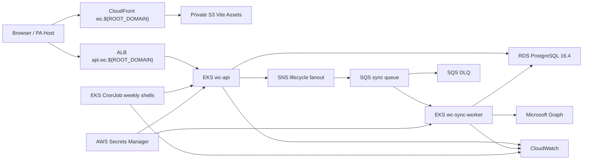
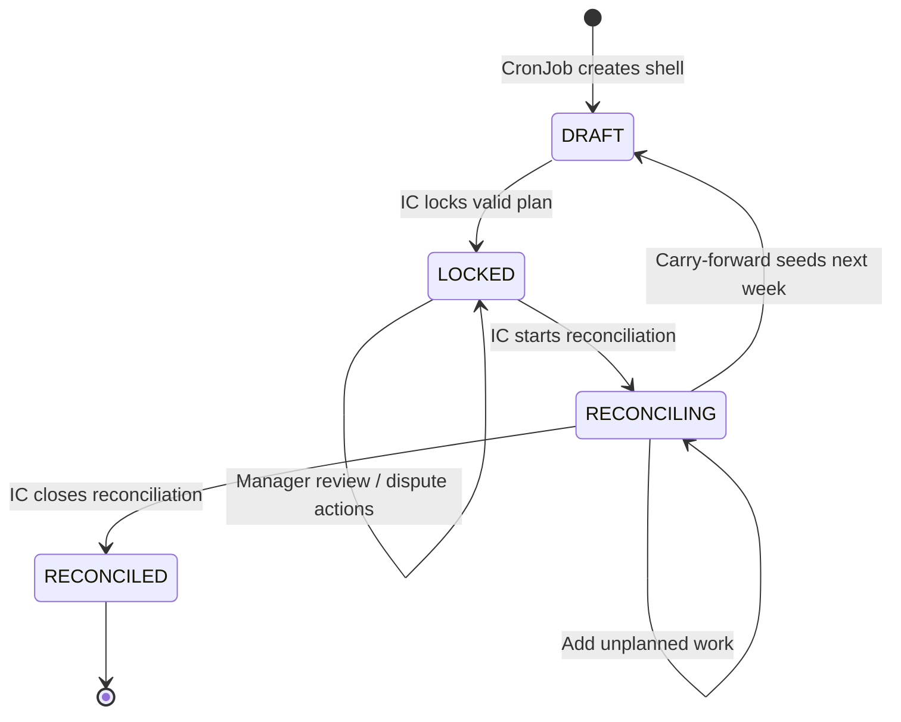
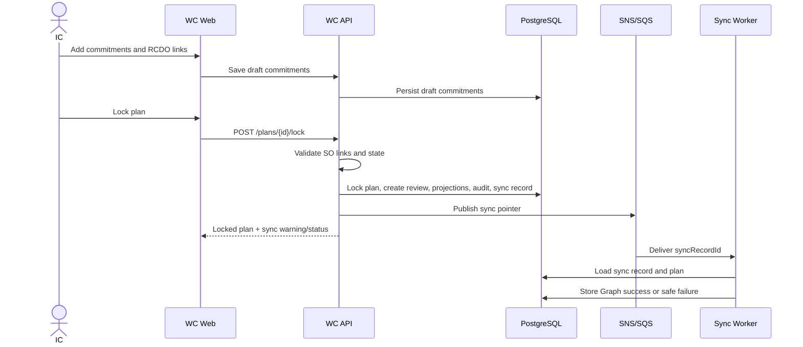
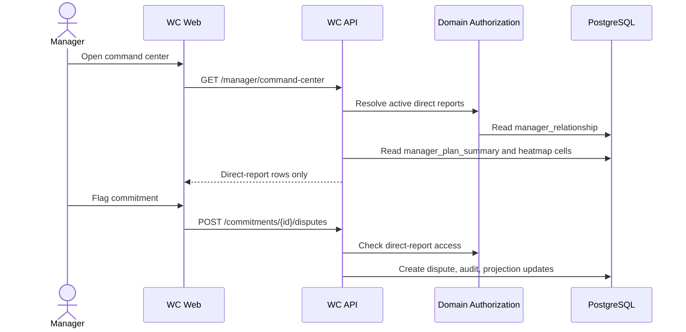
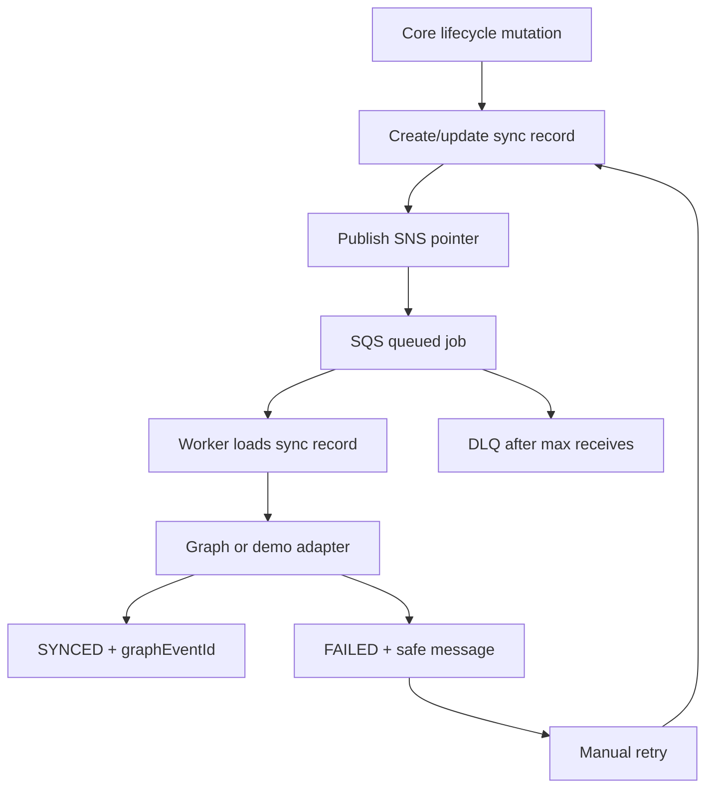

# Diagram Plan

> Status: Draft planning artifact
> Phase: 17 - Diagram plan
> Date: 2026-06-02
> Sources: `ARCHITECTURE_DRAFT.md`, `DECISIONS.md`, `DATA_MODEL.md`, `THREAT_MODEL.md`

## Purpose

These diagrams should accompany the finalized root `ARCHITECTURE.md`. They are not decorative. Each diagram should answer a review question that implementation, security, or assessment reviewers will ask.

Classification: proposed recommendation for `/arch-finalize`.

## Diagram 1 - System Context And AWS Runtime

Question answered: What runs where, and how does WC satisfy the required AWS infrastructure?

Include:

- Browser loads WC frontend from CloudFront.
- CloudFront uses private S3 origin with Origin Access Control.
- Frontend calls API at `api.wc.${ROOT_DOMAIN}` through ALB/EKS.
- API writes RDS PostgreSQL 16.4.
- API publishes lifecycle/sync events to SNS.
- SQS subscription delivers Outlook sync jobs to EKS worker.
- Worker calls Microsoft Graph or demo adapter.
- Secrets Manager provides DB/Auth0/Graph config to EKS workloads.
- CloudWatch receives logs/metrics.

Mermaid draft:

## Diagram 2 - Weekly Plan Lifecycle State Machine

Question answered: What state transitions are legal, and where are manager review and disputes separate from the IC lifecycle?

Include:

- `DRAFT -> LOCKED -> RECONCILING -> RECONCILED`.
- Carry-forward as an outcome that seeds next week.
- Manager review status as parallel state, not part of plan lifecycle.
- Overdue as derived from review due date.
- No unlock/amend transition in MVP.

Mermaid draft:

## Diagram 3 - IC Draft, Lock, Reconcile Sequence

Question answered: How does the IC workflow preserve baseline truth and trigger Outlook without blocking?

Include:

- IC drafts commitments.
- API validates Supporting Outcome links.
- Lock freezes planned baseline.
- API creates manager review, projection rows, audit event, sync record.
- SNS/SQS/worker sync runs after core mutation.
- Reconciliation supports unplanned work and carry-forward.

Mermaid draft:

## Diagram 4 - Manager Command Center Sequence

Question answered: How does a manager review direct reports without seeing the whole company?

Include:

- Manager loads command center.
- API resolves authenticated employee.
- Domain authorization service scopes to active direct reports.
- API reads projection tables.
- Manager opens dispute with required note.
- IC responds; manager resolves.

Mermaid draft:

## Diagram 5 - Physical Data Model ERD

Question answered: Which tables own source of truth vs projections?

Include:

- `employee`
- `manager_relationship`
- `weekly_plan`
- `weekly_commitment`
- RCDO tables
- `manager_review`
- `alignment_dispute`
- `comment`
- `outlook_calendar_sync_record`
- `manager_plan_summary`
- `manager_heatmap_cell`
- `audit_event`

Finalizer should convert this into an ERD. If the final root doc needs brevity, show source tables in the main architecture and put projection/sync tables in an appendix.

## Diagram 6 - Outlook Sync And Retry Flow

Question answered: How do Graph failures remain non-blocking and retryable?

Include:

- Core mutation commits first.
- Sync record is durable outbox.
- SNS/SQS payload contains pointer fields only.
- Worker state transitions.
- DLQ for repeated worker failures.
- UI retry updates existing sync record.

Mermaid draft:

## Diagram 7 - Trust Boundaries

Question answered: Where are the security boundaries and what controls protect them?

Include:

- Browser to API.
- Demo identity header to backend identity adapter.
- Auth0 JWT to API.
- API to PostgreSQL.
- API to SNS/SQS.
- Worker to Graph.
- EKS to Secrets Manager.
- CloudFront/S3 to browser.
- GitHub Actions to AWS.

Use `THREAT_MODEL.md` as the source of truth.

## Diagram 8 - Module Federation Boundary

Question answered: How does WC run standalone while remaining PA-loadable as a remote?

Include:

- Standalone Vite dev/build entry.
- Remote `wc` with `remoteEntry.js`.
- One exposed route/module entry point.
- Shared singleton React/React DOM/Redux dependencies.
- No hardcoded PA shell navigation.
- PA-owned LogRocket/Loki/global navigation outside WC.

## Diagram 9 - CI/CD And Quality Gates

Question answered: What proves the implementation is production-shaped?

Include:

- GitHub Actions.
- Frontend lint/format/Vitest/build.
- Backend Spotless/SpotBugs/test/JaCoCo.
- Cypress/Cucumber local E2E.
- Build API/worker images and push ECR.
- Terraform plan/apply.
- Deploy EKS workloads.
- Sync frontend assets to S3 and invalidate CloudFront.
- Deployed smoke tests against custom domains.

## Diagram Priorities

If time is short, include diagrams in this order:

1. System Context And AWS Runtime.
2. Weekly Plan Lifecycle State Machine.
3. Outlook Sync And Retry Flow.
4. Physical Data Model ERD.
5. Manager Command Center Sequence.
6. Trust Boundaries.
7. Module Federation Boundary.
8. CI/CD And Quality Gates.
9. IC Draft, Lock, Reconcile Sequence.

## Finalizer Notes

- Keep labels short enough for root `ARCHITECTURE.md`.
- Prefer one architecture diagram plus two focused diagrams over a crowded mega-diagram.
- Use exact custom-domain placeholders: `wc.${ROOT_DOMAIN}` and `api.wc.${ROOT_DOMAIN}`.
- Do not draw pass-up/escalation, RCDO admin, or leadership rollups as MVP paths.
